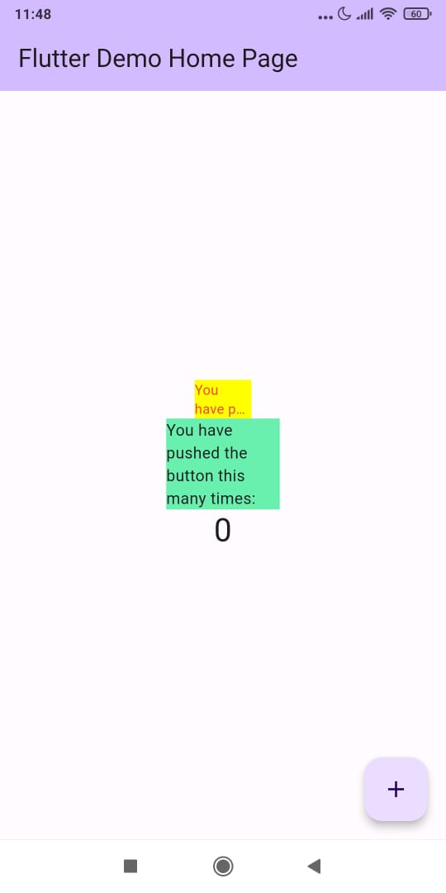

# Tugas Minggu 10, Mobile Programming - Manajemen Plugin

##### Nama  : Mochamad Driya Ananta
##### Kelas : TI-3H
##### Nim   : 2141720224
##### No    : 17

### 8. Tugas Praktikum

### File red_text_widget
``` 
import 'package:auto_size_text/auto_size_text.dart';
import 'package:flutter/material.dart';

class RedTextWidget extends StatelessWidget {
  final String text;

  const RedTextWidget({Key? key, required this.text}) : super(key: key);

  @override
  Widget build(BuildContext context) {
    return AutoSizeText(
      text,
      style: const TextStyle(color: Colors.red, fontSize: 14),
      maxLines: 2,
      overflow: TextOverflow.ellipsis,
    );
  }
}
```

```
import 'package:flutter/material.dart';
import 'package:flutter_plugin_pubdev/widgets/red_text_widget.dart';

void main() {
  runApp(const MyApp());
}

class MyApp extends StatelessWidget {
  const MyApp({super.key});

  // This widget is the root of your application.
  @override
  Widget build(BuildContext context) {
    return MaterialApp(
      title: 'Flutter Demo',
      debugShowCheckedModeBanner: false,
      theme: ThemeData(
        colorScheme: ColorScheme.fromSeed(seedColor: Colors.deepPurple),
        useMaterial3: true,
      ),
      home: const MyHomePage(title: 'Flutter Demo Home Page'),
    );
  }
}

class MyHomePage extends StatefulWidget {
  const MyHomePage({super.key, required this.title});

  final String title;

  @override
  State<MyHomePage> createState() => _MyHomePageState();
}

class _MyHomePageState extends State<MyHomePage> {
  int _counter = 0;

  void _incrementCounter() {
    setState(() {
      _counter++;
    });
  }

  @override
  Widget build(BuildContext context) {
    return Scaffold(
      appBar: AppBar(
        backgroundColor: Theme.of(context).colorScheme.inversePrimary,
        title: Text(widget.title),
      ),
      body: Center(
        child: Column(
          mainAxisAlignment: MainAxisAlignment.center,
          children: <Widget>[
            Container(
              color: Colors.yellowAccent,
              width: 50,
              child: const RedTextWidget(
                text: 'You have pushed the button this many times:',
              ),
            ),
            Container(
              color: Colors.greenAccent,
              width: 100,
              child: const Text(
                'You have pushed the button this many times:',
              ),
            ),
            Text(
              '$_counter',
              style: Theme.of(context).textTheme.headlineMedium,
            ),
          ],
        ),
      ),
      floatingActionButton: FloatingActionButton(
        onPressed: _incrementCounter,
        tooltip: 'Increment',
        child: const Icon(Icons.add),
      ), // This trailing comma makes auto-formatting nicer for build methods.
    );
  }
}

```
1. Selesaikan Praktikum tersebut, lalu dokumentasikan dan push ke repository Anda berupa screenshot hasil pekerjaan beserta penjelasannya di file README.md!

  - Hasil dari praktikum tersebut adalah sebagai berikut: 
   


2. Jelaskan maksud dari langkah 2 pada praktikum tersebut!
  - Jawab : Jawab: Langkah tersebut akan menambahkan dependensi auto_size_text ke dalam proyek yang sedang kita kembangkan. Perintah flutter pub add digunakan untuk menambahkan dependensi atau plugin ke proyek yang sedang kita kembangkan. Ketika menjalankan perintah flutter pub add auto_size_text di terminal, Flutter akan secara otomatis men-download dan mengintegrasikan plugin auto_size_text ke dalam proyek kita. Setelah proses download dan integrasi selesai, kita akan melihat bahwa di dalam file pubspec.yaml telah ditambahkan dependensi auto_size_text.

3. Jelaskan maksud dari langkah 5 pada praktikum tersebut!
  - Jawab : 
    - final String text; Ini adalah deklarasi variabel untuk menyimpan teks yang akan ditampilkan dalam widget.
    - Kemudian, konstruktor RedTextWidget akan menerima parameter key dan text.
    - Parameter key digunakan untuk mengidentifikasi instance dari widget ini.
    - Sedangkan parameter text adalah teks yang akan ditampilkan dalam RedTextWidget.
    - Parameter text memiliki label "required," yang berarti Anda harus memberikan nilai saat membuat instance RedTextWidget.
    - Nilai dari parameter text ini akan digunakan untuk menampilkan teks dalam widget.

4. Pada langkah 6 terdapat dua widget yang ditambahkan, jelaskan fungsi dan perbedaannya!
  - Jawab : 
    - Widget pertama adalah Container yang berisi instance dari widget RedTextWidget. Widget ini digunakan untuk menampilkan teks dengan warna merah dan penyesuaian ukuran teks secara otomatis. Dalam Container ini, latar belakangnya diatur menjadi warna kuning (Colors.yellowAccent) dan lebar Container diatur menjadi 50 piksel.
    - Widget kedua adalah Container yang berisi instance dari widget Text. Widget ini digunakan untuk menampilkan teks dengan ukuran teks yang tetap. Dalam Container ini, latar belakangnya diatur menjadi warna hijau (Colors.greenAccent) dan lebar Container diatur menjadi 100 piksel.

    perbedaannya adalah pada widget pertama menggunakan RedTextWidget yang mana didalamnya terdapat auto_size_text sedangkan widget kedua menggunakan Text yang mana didalamnya tidak terdapat auto_size_text.

5. Jelaskan maksud dari tiap parameter yang ada di dalam plugin auto_size_text berdasarkan tautan pada dokumentasi ini !
  - Jawab : 
    - Parameter "text" adalah teks yang akan ditampilkan dalam widget "AutoSizeText." "AutoSizeText" adalah sebuah widget dalam Flutter yang secara otomatis menyesuaikan ukuran font teks sesuai dengan ruang yang tersedia. Parameter "text" digunakan untuk menyediakan teks yang akan ditampilkan dalam widget "AutoSizeText."
    - Parameter "style" digunakan untuk mengatur gaya teks, seperti warna dan ukuran font. Dalam contoh ini, kita mengatur warna teks menjadi merah (red) dan ukuran fontnya menjadi 14.
    - Parameter "maxLines" adalah sebuah opsi yang menentukan jumlah maksimum baris yang akan digunakan untuk menampilkan teks. Jika kita mengatur "maxLines" menjadi 2, itu berarti teks akan ditampilkan dalam maksimal 2 baris. Jika teks melebihi kapasitas tersebut, maka teks akan dipotong dan ditampilkan dengan tanda elipsis (tanda ...).
    - Parameter "overflow" mengendalikan perilaku teks ketika melebihi jumlah baris yang telah diatur oleh "maxLines." Jika kita mengatur "overflow" sebagai "TextOverflow.ellipsis," maka teks yang tidak muat akan ditampilkan dengan tanda elipsis di akhir teks. Ini memberikan petunjuk visual kepada pengguna bahwa teks telah dipotong karena terlalu panjang.

6. Kumpulkan laporan praktikum Anda berupa link repository GitHub ke spreadsheet yang telah disediakan!
  [Code-Program](https://github.com/Driyaannt/2141720224-mobile-2023/tree/main/week-10/src/flutter_plugin_pubdev)