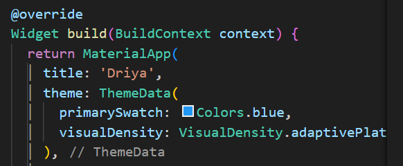
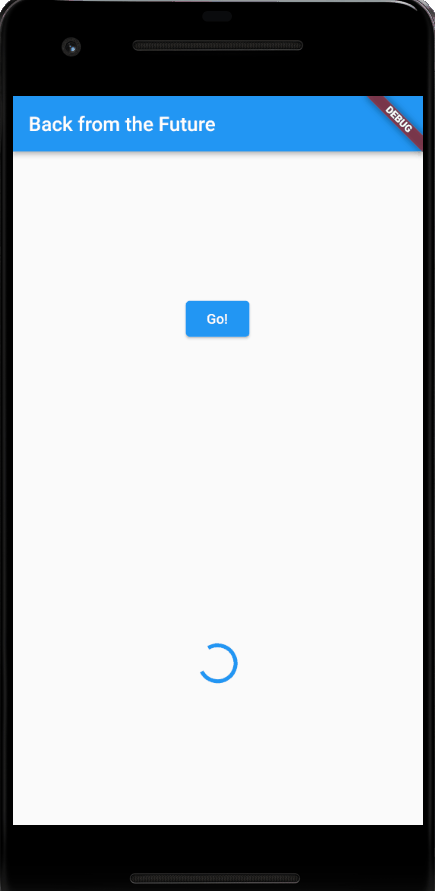

# Tugas Minggu 12, Mobile Programming - Pemrograman Asynchronous di Flutter

##### Nama  : Mochamad Driya Ananta
##### Kelas : TI-3H
##### No    : 17

### Mengunduh Data dari Web Service (API)

 1. Tambahkan nama panggilan Anda pada title app sebagai identitas hasil pekerjaan Anda.
    - Jawab :

    

 2.  - Carilah judul buku favorit Anda di Google Books, lalu ganti ID buku pada variabel path di kodetersebut. Caranya ambil di URL browser Anda seperti gambar berikut ini.

- Kemudian cobalah akses di browser URI tersebut dengan lengkap seperti ini. Jika menampilkan data JSON, maka Anda telah berhasil. Lakukan capture milik Anda dan tulis di README pada laporan praktikum. Lalu lakukan commit dengan pesan "W12: Soal 2".

3.  - Jelaskan maksud kode langkah 5 tersebut   terkait substring dan catchError!
    - Jawab: 
    -   Di sini, value.body.toString() mengonversi tubuh respons HTTP ke dalam bentuk string, dan kemudian substring(0, 450) digunakan untuk mengambil potongan dari string tersebut, mulai dari indeks 0 hingga indeks 449 (sepanjang 450 karakter). Hasilnya kemudian disimpan dalam variabel result.
    - catchError((_) {...}):
    catchError adalah metode yang digunakan untuk menangani kesalahan (error) yang terjadi selama eksekusi Future.
    (_) adalah parameter yang digunakan untuk menangkap kesalahan. Dalam hal ini, kita tidak menggunakan nilai kesalahan tersebut, dan oleh karena itu menggunakan underscore (_) untuk menunjukkan bahwa nilai tersebut tidak digunakan.
    Dalam konteks ini, jika ada kesalahan selama eksekusi getData(), kita menangkapnya dan mengatur pesan kesalahan ke dalam variabel result. Kemudian kita memanggil setState untuk memperbarui tampilan UI dengan pesan kesalahan.
- Capture hasil praktikum Anda berupa GIF dan lampirkan di README. Lalu lakukan commit dengan pesan "W12: Soal 3".

- Hasil

4. - Jelaskan maksud kode langkah 1 dan 2 tersebut!
    - Jawab:
    Langkah 1:
    - Mendefinisikan tiga fungsi asinkron (`returnOneAsync`, `returnTwoAsync`, dan `returnThreeAsync`).
    - Setiap fungsi menggunakan `Future.delayed` untuk menunda eksekusi selama 3 detik dan kemudian mengembalikan nilai integer (1, 2, dan 3).

    Langkah 2:
    - Mendefinisikan fungsi asinkron `count` yang bertujuan untuk menjumlahkan hasil dari tiga fungsi asinkron pada Langkah 1.
    - Menggunakan kata kunci `await` untuk menunggu hasil dari setiap fungsi sebelum melanjutkan eksekusi berikutnya.
    - Memperbarui state Flutter (`result`) dengan hasil penjumlahan tersebut menggunakan `setState`.
    - Dengan demikian, memastikan bahwa hasil perhitungan asinkron tercermin pada tampilan UI setelah semua operasi selesai.

- Capture hasil praktikum Anda berupa GIF dan lampirkan di README. Lalu lakukan commit dengan pesan "W12: Soal 4".

- Hasil

