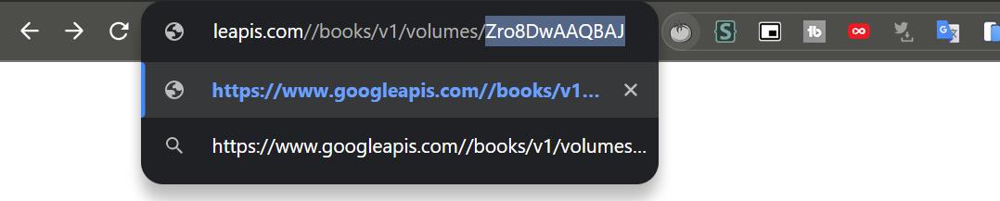

# Tugas Minggu 12, Mobile Programming - Pemrograman Asynchronous di Flutter

##### Nama  : Mochamad Driya Ananta
##### Kelas : TI-3H
##### No    : 17

### Mengunduh Data dari Web Service (API)

 1. Tambahkan nama panggilan Anda pada title app sebagai identitas hasil pekerjaan Anda.
    - Jawab :

    

 2.  - Carilah judul buku favorit Anda di Google Books, lalu ganti ID buku pada variabel path di kodetersebut. Caranya ambil di URL browser Anda seperti gambar berikut ini.

- Kemudian cobalah akses di browser URI tersebut dengan lengkap seperti ini. Jika menampilkan data JSON, maka Anda telah berhasil. Lakukan capture milik Anda dan tulis di README pada laporan praktikum. Lalu lakukan commit dengan pesan "W12: Soal 2".

