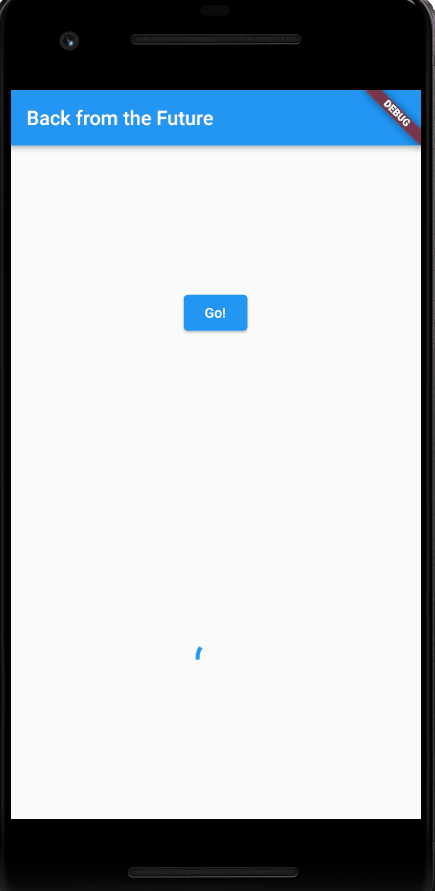
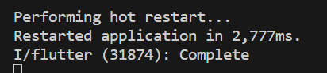
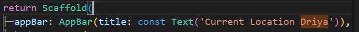

# Tugas Minggu 12, Mobile Programming - Pemrograman Asynchronous di Flutter

##### Nama  : Mochamad Driya Ananta
##### Kelas : TI-3H
##### No    : 17

### Mengunduh Data dari Web Service (API)

 1. Tambahkan nama panggilan Anda pada title app sebagai identitas hasil pekerjaan Anda.
    - Jawab :

    

 2.  - Carilah judul buku favorit Anda di Google Books, lalu ganti ID buku pada variabel path di kodetersebut. Caranya ambil di URL browser Anda seperti gambar berikut ini.

- Kemudian cobalah akses di browser URI tersebut dengan lengkap seperti ini. Jika menampilkan data JSON, maka Anda telah berhasil. Lakukan capture milik Anda dan tulis di README pada laporan praktikum. Lalu lakukan commit dengan pesan "W12: Soal 2".

3.  - Jelaskan maksud kode langkah 5 tersebut   terkait substring dan catchError!
    - Jawab: 
    -   Di sini, value.body.toString() mengonversi tubuh respons HTTP ke dalam bentuk string, dan kemudian substring(0, 450) digunakan untuk mengambil potongan dari string tersebut, mulai dari indeks 0 hingga indeks 449 (sepanjang 450 karakter). Hasilnya kemudian disimpan dalam variabel result.
    - catchError((_) {...}):
    catchError adalah metode yang digunakan untuk menangani kesalahan (error) yang terjadi selama eksekusi Future.
    (_) adalah parameter yang digunakan untuk menangkap kesalahan. Dalam hal ini, kita tidak menggunakan nilai kesalahan tersebut, dan oleh karena itu menggunakan underscore (_) untuk menunjukkan bahwa nilai tersebut tidak digunakan.
    Dalam konteks ini, jika ada kesalahan selama eksekusi getData(), kita menangkapnya dan mengatur pesan kesalahan ke dalam variabel result. Kemudian kita memanggil setState untuk memperbarui tampilan UI dengan pesan kesalahan.
- Capture hasil praktikum Anda berupa GIF dan lampirkan di README. Lalu lakukan commit dengan pesan "W12: Soal 3".

- Hasil

4. - Jelaskan maksud kode langkah 1 dan 2 tersebut!
    - Jawab:
    Langkah 1:
    - Mendefinisikan tiga fungsi asinkron (`returnOneAsync`, `returnTwoAsync`, dan `returnThreeAsync`).
    - Setiap fungsi menggunakan `Future.delayed` untuk menunda eksekusi selama 3 detik dan kemudian mengembalikan nilai integer (1, 2, dan 3).

    Langkah 2:
    - Mendefinisikan fungsi asinkron `count` yang bertujuan untuk menjumlahkan hasil dari tiga fungsi asinkron pada Langkah 1.
    - Menggunakan kata kunci `await` untuk menunggu hasil dari setiap fungsi sebelum melanjutkan eksekusi berikutnya.
    - Memperbarui state Flutter (`result`) dengan hasil penjumlahan tersebut menggunakan `setState`.
    - Dengan demikian, memastikan bahwa hasil perhitungan asinkron tercermin pada tampilan UI setelah semua operasi selesai.

- Capture hasil praktikum Anda berupa GIF dan lampirkan di README. Lalu lakukan commit dengan pesan "W12: Soal 4".

- Hasil

5. - Jelaskan maksud kode langkah 2 tersebut!
    - jawab:
    Kode yang diberikan menggunakan objek Completer untuk mengelola operasi asinkron dan memberikan kontrol atas kapan operasi tersebut selesai. Berikut rangkuman langkah-langkahnya:

    - Deklarasi Completer: Variabel completer dideklarasikan sebagai late Completer, menandakan bahwa inisialisasi akan dilakukan nanti.

        Fungsi getNumber():

    - Inisialisasi objek Completer dengan tipe integer.
    Memanggil fungsi calculate() untuk memulai operasi asinkron.
    Mengembalikan future dari completer, yang memungkinkan pihak lain untuk menunggu hasil dari operasi asinkron tersebut.
    Fungsi calculate():

    - Menunda eksekusi selama 5 detik untuk mensimulasikan operasi asinkron.
    Menggunakan completer.complete(42) untuk menyelesaikan Future dengan nilai 42 setelah penundaan selesai.

    - Capture hasil praktikum Anda berupa GIF dan lampirkan di README. Lalu lakukan commit dengan pesan "W12: Soal 5".

    - Hasil
    

6.  - Jelaskan maksud perbedaan kode langka 2 dengan langkah 5-6 tersebut!
    - Jawab:
    - Langkah 2:
    - Menggunakan Future.delayed untuk menunda eksekusi selama 3 detik dan kemudian mengembalikan nilai integer (1, 2, dan 3).
    - Langkah 5-6:
    - Menggunakan Completer untuk mengelola operasi asinkron dan memberikan kontrol atas kapan operasi tersebut selesai.
    - Deklarasi Completer: Variabel completer dideklarasikan sebagai late Completer, menandakan bahwa inisialisasi akan dilakukan nanti.
    - Fungsi getNumber():
    Inisialisasi objek Completer dengan tipe integer.
    Memanggil fungsi calculate() untuk memulai operasi asinkron.

    - Capture hasil praktikum Anda berupa GIF dan lampirkan di README. Lalu lakukan commit dengan pesan "W12: Soal 6".

    - Hasil
    
    
7. - Capture hasil praktikum Anda berupa GIF dan lampirkan di README. Lalu lakukan commit dengan pesan "W12: Soal 7".
    

8.  - Jelaskan maksud perbedaan kode langkah 1 dan 4!
    - Jawab:
    - Langkah 1:
    - Menggunakan Future.delayed untuk menunda eksekusi selama 3 detik dan kemudian mengembalikan nilai integer (1, 2, dan 3).
    - Langkah 4:
    - Menggunakan Future.wait untuk menunggu hasil dari tiga fungsi asinkron pada Langkah 1.
    - Menggunakan kata kunci await untuk menunggu hasil dari setiap fungsi sebelum melanjutkan eksekusi berikutnya. 
9.  - Capture hasil praktikum Anda berupa GIF dan lampirkan di README. Lalu lakukan commit dengan pesan "W12: Soal 9".
    - Hasil
    

10. - Panggil method handleError() tersebut di ElevatedButton, lalu run. Apa hasilnya? Jelaskan perbedaan kode langkah 1 dan 4!

    -jawab:
    - Hasilnya adalah menampilkan pesan error pada tampilan UI.
    - Langkah 1:
    - menggunakan retiurn Future.error untuk menampilkan pesan error pada tampilan UI. dengan throw Exception('Something terriable happened').
    - Langkah 4:
    - menggunakan catchError untuk menampilkan pesan error pada tampilan UI. catchError dan finally ('complete') untuk menampilkan pesan error pada tampilan UI.

    -hasil
    - 
    - 

11. - Tambahkan nama panggilan Anda pada tiap properti title sebagai identitas pekerjaan Anda.
    - 

12. - Jika Anda tidak melihat animasi loading tampil, kemungkinan itu berjalan sangat cepat. Tambahkan delay pada method getPosition() dengan kode await Future.delayed(const Duration(seconds: 3));
    - Apakah Anda mendapatkan koordinat GPS ketika run di browser? Mengapa demikian?
    - Jawab:
    - mendapatkan koordinat GPS ketika run di browser. karena browser mengizinkan untuk mengakses lokasi pengguna.
    - Capture hasil praktikum Anda berupa GIF dan lampirkan di README. Lalu lakukan commit dengan pesan "W12: Soal 12".
    - jawab
    - 

13. - Apakah ada perbedaan UI dengan praktikum sebelumnya? Mengapa demikian?
    -  Jawab:
    - Kedua praktikum tidak memiliki perbedaan pada antarmuka pengguna (UI), karena keduanya masih mengambil lokasi secara bersamaan dalam blok initState. Pada kasus pertama, setState digunakan untuk memperbarui myPosition setelah mendapatkan posisi, sedangkan pada kasus kedua, FutureBuilder secara otomatis mengelola pembaruan UI berdasarkan status future position. Meskipun hasil tampilan UI akhirnya serupa karena keduanya memiliki penundaan 3 detik, FutureBuilder mengatasi pembaruan UI tanpa pemanggilan setState langsung.

14. - Apakah ada perbedaan UI dengan langkah sebelumnya? Mengapa demikian?
    - Jawab:
    - Tidak ada perbedaan dalam antarmuka pengguna (UI) dibandingkan dengan langkah sebelumnya. Pada langkah ini, hanya ditambahkan handleError() yang akan dieksekusi saat terjadi kesalahan. Namun, karena tidak ada kesalahan yang terjadi selama pemrosesan data lokasi pada langkah ini, bagian "Something terrible happened!" dari blok penanganan kesalahan tidak akan ditampilkan.
    - Capture hasil praktikum Anda berupa GIF dan lampirkan di README. Lalu lakukan commit dengan pesan "W12: Soal 14".
    - Hasil:
    - 

15. 
