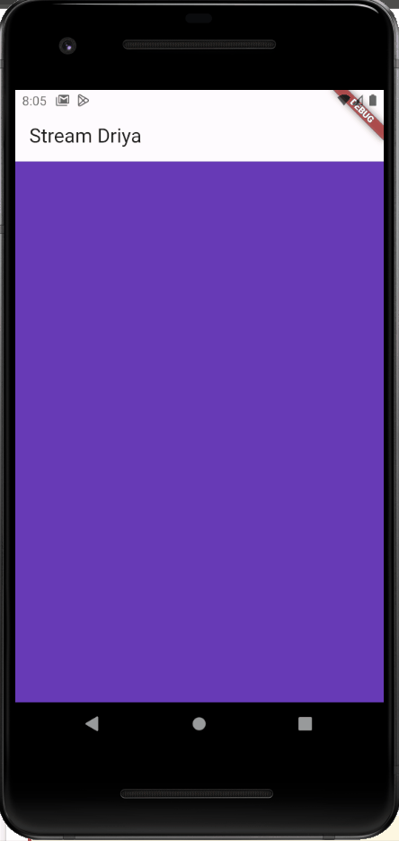
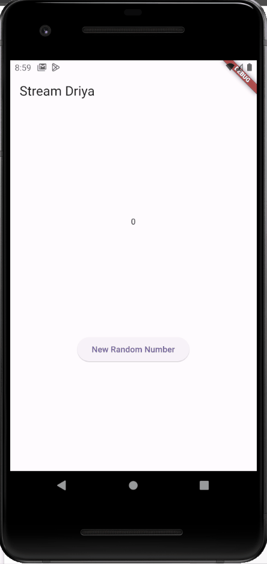
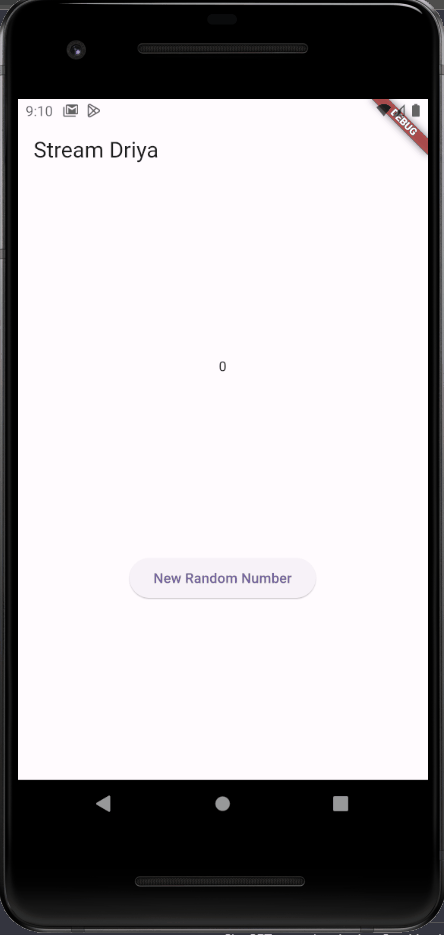
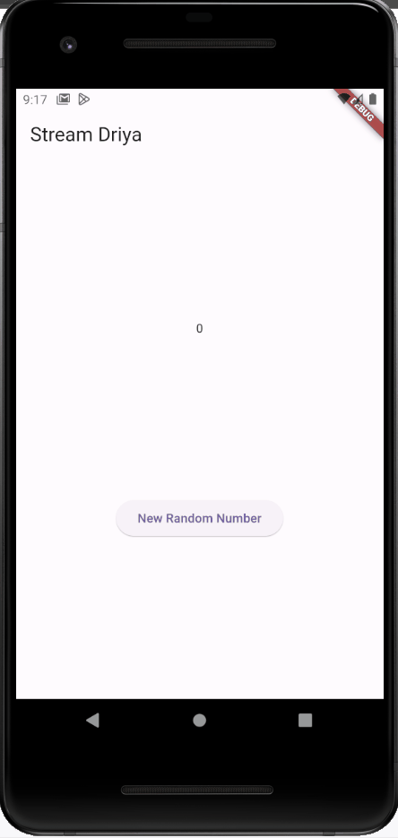
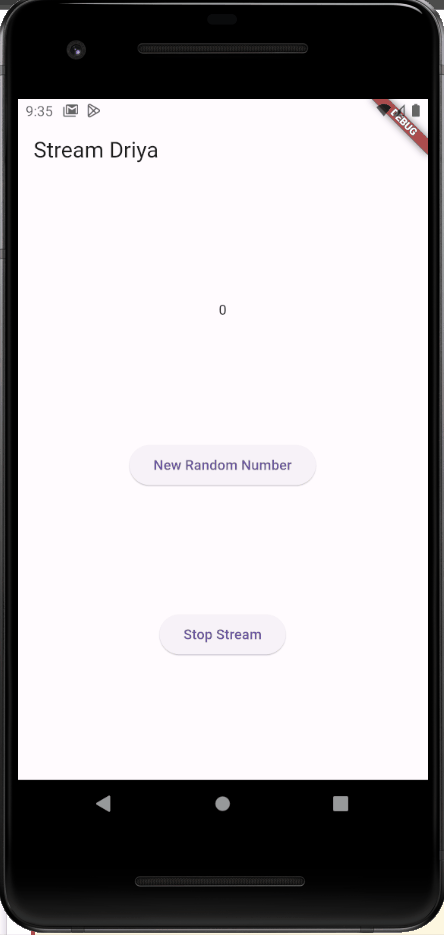
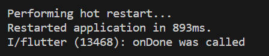
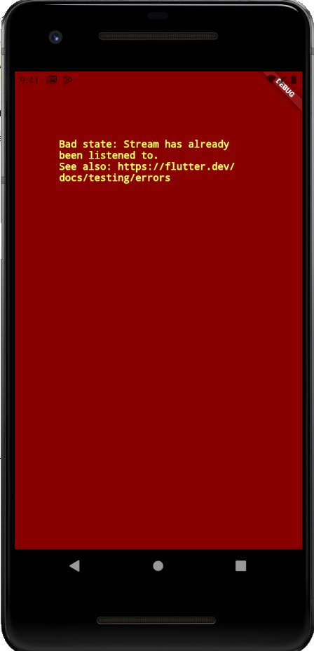
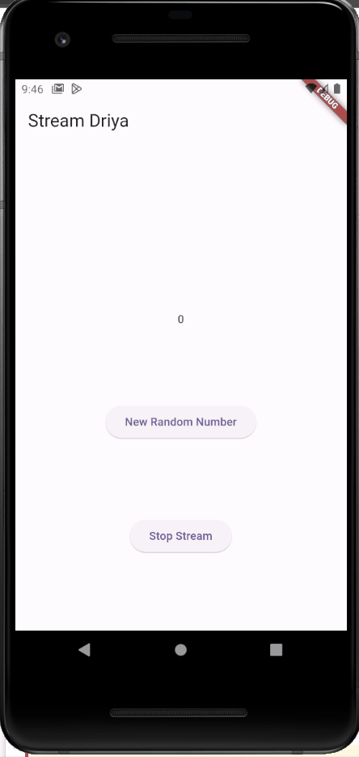
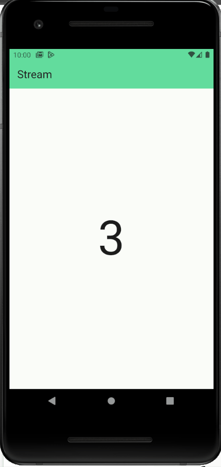

# Tugas Minggu 13, Mobile Programming - State Management dengan Streams

##### Nama  : Mochamad Driya Ananta
##### Kelas : TI-3H
##### No    : 17

### State Management dengan Streams

### Soal 1
 - Tambahkan nama panggilan Anda pada title app sebagai identitas hasil pekerjaan Anda.
 - Gantilah warna tema aplikasi sesuai kesukaan Anda.
 - Lakukan commit hasil jawaban Soal 1 dengan pesan "W13: Jawaban Soal 1"

 - Hasilnya:
    - 

### Soal 2

 - Tambahkan 5 warna lainnya sesuai keinginan Anda pada variabel colors tersebut.
 - Lakukan commit hasil jawaban Soal 2 dengan pesan "W13: Jawaban Soal 2"

 - Hasilnya:
    - 

### Soal 3

 - Jelaskan fungsi keyword yield* pada kode tersebut!
 - jawab :
     Penggunaan yield* terkait dengan stream dan digunakan untuk menghubungkan atau 'meneruskan' nilai-nilai dari satu stream ke stream lainnya. Saat kita menggunakan async* dan yield*, itu berarti kode tersebut dirancang untuk menghasilkan nilai-nilai dari suatu stream secara berurutan tanpa perlu secara eksplisit mengeluarkan setiap nilai satu per satu.
 - Apa maksud isi perintah kode tersebut?
    - jawab :
    Kode tersebut mendefinisikan suatu kelas bernama ColorStream yang memiliki metode getColors berupa asynchronous generator function. Fungsinya adalah menghasilkan suatu stream warna yang akan berulang setiap detik, dan warna-warna yang ditampilkan berasal dari daftar warna yang telah diatur sebelumnya. Dengan kata lain, metode getColors mengeluarkan warna-warna dari daftar tersebut sebagai stream, dan proses ini berulang setiap detik.
 - Lakukan commit hasil jawaban Soal 3 dengan pesan "W13: Jawaban Soal 3" 

### Soal 4

 -  Capture hasil praktikum Anda berupa GIF dan lampirkan di README.
- Lakukan commit hasil jawaban Soal 4 dengan pesan "W13: Jawaban Soal 4"

- Hasilnya:
    - 

### Soal 5

 - Jelaskan perbedaan menggunakan listen dan await for (langkah 9) !
    - jawab :
    - await for:

    - Digunakan untuk mendengarkan stream secara langsung dan menunggu setiap iterasi selesai sebelum melanjutkan ke iterasi berikutnya.
    Berguna ketika kita perlu menangani setiap nilai stream secara berurutan dan sinkron.
    
    - listen:

    - Digunakan untuk menambahkan pendengar ke dalam stream.
    Tidak menggunakan await, sehingga pembaruan atau penanganan nilai dapat terjadi secara asinkron, tanpa menunggu satu iterasi selesai sebelum melanjutkan ke iterasi berikutnya.
    Dengan kata lain, await for berguna ketika kita perlu menangani nilai stream secara sinkron, sementara listen digunakan untuk menangani nilai secara asinkron, tanpa memblokir proses berikutnya.

 - Lakukan commit hasil jawaban Soal 5 dengan pesan "W13: Jawaban Soal 5"

### Soal 6

 - Jelaskan maksud kode langkah 8 dan 10 tersebut!
    - jawab :
    - Langkah 8 melibatkan pembuatan objek NumberStream, yang menggunakan StreamController untuk mengelola stream. Saat aplikasi diinisialisasi, kita menghubungkan controller tersebut ke stream. Setiap kali stream menghasilkan nilai baru, seperti angka baru, kita menggunakan setState() untuk memperbarui tampilan.

    - Langkah 10 melibatkan pembuatan suatu metode yang bertujuan menambahkan angka acak ke dalam stream. Dalam metode ini, kita menggunakan objek Random untuk menghasilkan nilai acak. Selanjutnya, nilai acak tersebut dimasukkan ke dalam stream menggunakan metode addNumberToSink pada objek numberStream. Dengan demikian, setiap kali metode ini dipanggil, angka acak baru akan ditambahkan ke dalam stream untuk diperbarui dalam tampilan.
 - Capture hasil praktikum Anda berupa GIF dan lampirkan di README.
 - hasilnya:
    - 
 
 - Lalu lakukan commit dengan pesan "W13: Jawaban Soal 6".

### Soal 7

 - Jelaskan maksud kode langkah 13 sampai 15 tersebut!
 - jawab :
    Pada langkah 13 hingga 15, kode tersebut menangani error dengan menggunakan metode `addError()` pada class stream.dart. Jika terjadi kesalahan atau error selama proses iterasi atau ketika stream menghasilkan nilai, maka nilai dari lastNumber akan diubah menjadi -1. Dengan demikian, langkah-langkah ini bertujuan untuk memberikan penanganan khusus terhadap situasi error, mengatur nilai lastNumber menjadi -1 sebagai respons terhadap kondisi yang tidak diharapkan.

    - 

 - Kembalikan kode seperti semula pada Langkah 15, comment addError() agar Anda dapat melanjutkan ke praktikum 3 berikutnya.
 - Lalu lakukan commit dengan pesan "W13: Jawaban Soal 7".

### Soal 8

 - Jelaskan maksud kode langkah 1-3 tersebut!
 - jawab :
   Kode tersebut menggunakan Flutter untuk mengelola stream data. Dengan menerapkan transformer, setiap nilai dalam stream dikalikan dengan 10. Hasilnya dimonitor menggunakan `listen`, dan nilai yang dihasilkan diperbarui dalam tampilan menggunakan `setState`. Jika terjadi error, nilai `lastNumber` diatur menjadi -1, dan transformer juga menangani error dengan mengirim pesan 'Error' ke dalam stream. Dengan cara ini, kode mengelola transformasi stream serta menangani event dan error yang mungkin terjadi.
 - Capture hasil praktikum Anda berupa GIF dan lampirkan di README.
    - hasilnya:
        - 
 - Lalu lakukan commit dengan pesan "W13: Jawaban Soal 8".

### Soal 9

 -  Jelaskan maksud kode langkah 2, 6 dan 8 tersebut!
  - jawab:
  - Langkah 2 menjelaskan bahwa kode digunakan untuk melakukan langganan atau subscribe pada stream agar bisa menerima informasi atau output dari stream tersebut.

  - Langkah 6 menjelaskan bahwa kode berfungsi untuk membatalkan atau menghentikan langganan pada stream. Saat layar tidak lagi ditampilkan, metode ini akan dipanggil untuk membersihkan sumber daya dan menghemat penyimpanan.

 - Langkah 8 mengindikasikan suatu kondisi, yaitu jika stream belum ditutup, maka angka yang ditampilkan akan sesuai dengan hasil random. Sebaliknya, jika stream telah ditutup atau langganan telah dihentikan, maka angka yang ditampilkan akan menjadi -1.
 - Capture hasil praktikum Anda berupa GIF dan lampirkan di README.
    - hasilnya:
        - 
        - 
 - Lalu lakukan commit dengan pesan "W13: Jawaban Soal 9".

### Soal 10

- Jelaskan mengapa error itu bisa terjadi ?
        - 

- jawab :
    - Error tersebut terjadi ketika mencoba untuk membuat dua langganan (subscription) pada stream yang sama tanpa membatalkan langganan sebelumnya. Kesalahan ini muncul pada tahap inisialisasi subscription2 dalam metode initState(). Ini terjadi karena sudah ada inisialisasi langganan untuk menangani stream yang sama pada waktu yang sama.

### Soal 11

 - Jelaskan mengapa hal itu bisa terjadi ?
 - jawab :
    - Saatin tombol 'New Random Number' ditekan, itu akan menghasilkan dua angka yang identik. Hasil ini berasal dari stream yang diakses oleh objek subscription dan subscription2, yang memberikan nilai sebagai event (angka acak) yang dipisahkan oleh tanda '-'. Saat tombol 'Stop Stream' ditekan, itu akan menghentikan langganan terhadap stream, sehingga stream tidak dapat menghasilkan output lagi meskipun tombol 'New Random Number' ditekan.
 - Capture hasil praktikum Anda berupa GIF dan lampirkan di README.
  - hasilnya:
        - 
 - Lalu lakukan commit dengan pesan "W13: Jawaban Soal 10,11".

### Soal 12
 - Jelaskan maksud kode pada langkah 3 dan 7 !
  - jawab :
   - Langkah 3 menggambarkan pembuatan class NumberStream() yang memiliki metode getNumbers() untuk memberikan stream berisi angka acak dengan interval 1 detik.

   - Langkah 7 menjelaskan pembuatan antarmuka pengguna (UI) untuk menampilkan nilai dari stream secara real-time. Penggunaan StreamBuilder memastikan antarmuka terupdate otomatis setiap kali ada perubahan di stream, entah itu perubahan nilai atau adanya kesalahan. Ketika terjadi kesalahan, pesan 'Error!' akan ditampilkan; ketika data dari stream diterima tanpa kesalahan, angka acak akan ditampilkan dengan ukuran font 96; namun, jika tidak ada data yang diterima, antarmuka akan menampilkan widget kosong.
 - Capture hasil praktikum Anda berupa GIF dan lampirkan di README.
    - hasilnya:
        - 
 - Lalu lakukan commit dengan pesan "W13: Jawaban Soal 12".

### Soal 13
