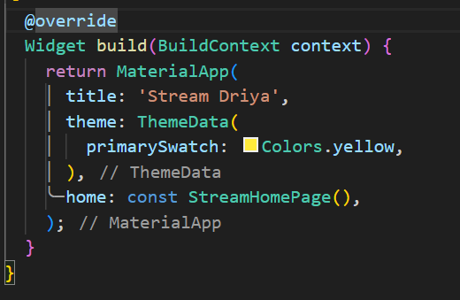
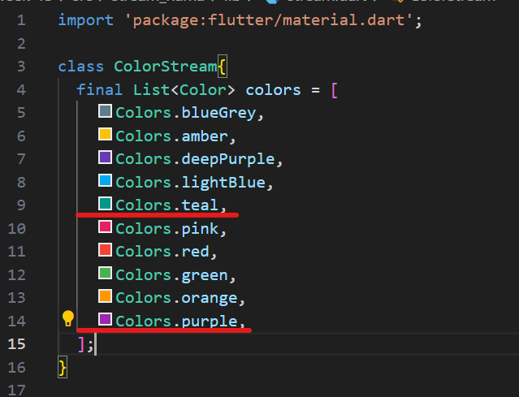

# Tugas Minggu 13, Mobile Programming - State Management dengan Streams

##### Nama  : Mochamad Driya Ananta
##### Kelas : TI-3H
##### No    : 17

### State Management dengan Streams

### Soal 1
 - Tambahkan nama panggilan Anda pada title app sebagai identitas hasil pekerjaan Anda.
 - Gantilah warna tema aplikasi sesuai kesukaan Anda.
 - Lakukan commit hasil jawaban Soal 1 dengan pesan "W13: Jawaban Soal 1"

 - Hasilnya:
    - 

### Soal 2

 - Tambahkan 5 warna lainnya sesuai keinginan Anda pada variabel colors tersebut.
 - Lakukan commit hasil jawaban Soal 2 dengan pesan "W13: Jawaban Soal 2"

 - Hasilnya:
    - 

### Soal 3

 - Jelaskan fungsi keyword yield* pada kode tersebut!
 - jawab :
     Penggunaan yield* terkait dengan stream dan digunakan untuk menghubungkan atau 'meneruskan' nilai-nilai dari satu stream ke stream lainnya. Saat kita menggunakan async* dan yield*, itu berarti kode tersebut dirancang untuk menghasilkan nilai-nilai dari suatu stream secara berurutan tanpa perlu secara eksplisit mengeluarkan setiap nilai satu per satu.
 - Apa maksud isi perintah kode tersebut?
    - jawab :
    Kode tersebut mendefinisikan suatu kelas bernama ColorStream yang memiliki metode getColors berupa asynchronous generator function. Fungsinya adalah menghasilkan suatu stream warna yang akan berulang setiap detik, dan warna-warna yang ditampilkan berasal dari daftar warna yang telah diatur sebelumnya. Dengan kata lain, metode getColors mengeluarkan warna-warna dari daftar tersebut sebagai stream, dan proses ini berulang setiap detik.
 - Lakukan commit hasil jawaban Soal 3 dengan pesan "W13: Jawaban Soal 3" 

 
