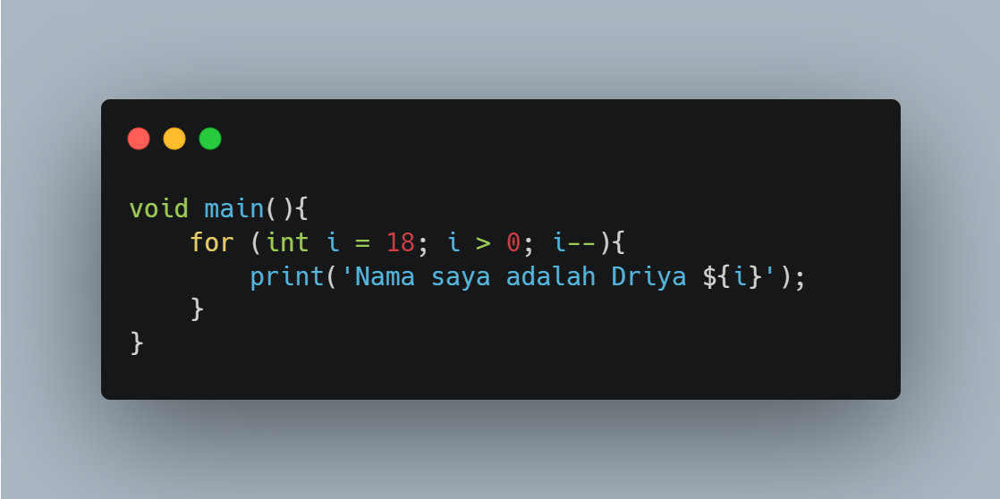
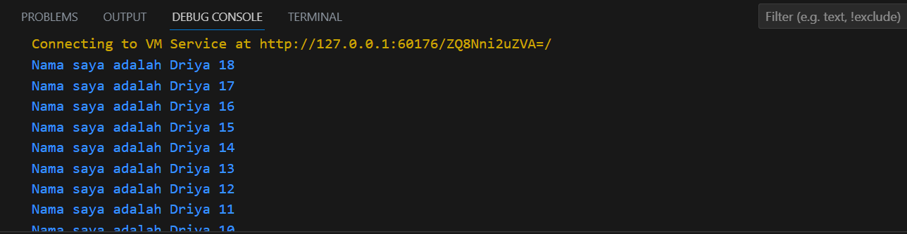

#Tugas Minggu 2, Mobile Programming

##### Nama  : Mochamad Driya Ananta
##### Kelas : TI-3H
##### Nim   : 2141720224
##### No    : 17

## Soal 1
##### Modifikasilah kode pada baris 3 di VS Code atau Editor Code favorit Anda berikut ini agar mendapatkan keluaran (output) sesuai yang diminta!

##### Berikut adalah perbaikan kode programmnya

##### Output Yang Diminta

##### Output Program saya sudah sesuai

## Soal 2
##### Mengapa sangat penting untuk memahami bahasa pemrograman Dart sebelum kita menggunakan framework Flutter ? Jelaskan!

Jawab : Menurut saya sangat penting dikarenakan ini adalah fondasi untuk mengguakan framework flutter seperti memahami sintaksis dan tipe data. Selain itu agar dapat menganalisis dan memecahkan masalah saat emnggunakan framework flutter .

## Soal 3
##### Rangkumlah materi dari codelab ini menjadi poin-poin penting yang dapat Anda gunakan untuk membantu proses pengembangan aplikasi mobile menggunakan framework Flutter.

##### Jawab :

Dart adalah bahasa pemrograman yang dirancang dengan tujuan menggabungkan kelebihan dari sebagian besar bahasa tingkat tinggi dengan fitur-fitur bahasa pemrograman terkini. Dart memiliki beberapa karakteristik utama:

- **Productive Tooling:** Dart menyediakan alat-alat produktif untuk pengembang dengan dukungan alat pengembangan yang kuat seperti DartPad dan dukungan pustaka Dart yang luas.

- **Garbage Collection:** Dart memiliki sistem pengumpulan sampah (garbage collection) yang mengelola alokasi memori dan pembebasan memori yang tidak lagi digunakan.

- **Type Annotations (Opsional):** Dart adalah bahasa yang secara opsional dapat diberi tipe (statis). Anda dapat menggunakan tipe untuk meningkatkan keamanan dan dokumentasi kode.

- **Statically Typed:** Dart adalah bahasa yang dapat diberi tipe statis, yang berarti tipe variabel dideklarasikan saat kompilasi dan diperiksa oleh kompiler.

- **Portability:** Dart dapat dieksekusi di berbagai platform, termasuk melalui Virtual Machines (VMs) dan kompilasi menjadi JavaScript, sehingga memungkinkan portabilitas kode.

Dart memiliki struktur dasar yang mencakup konsep-konsep seperti orientasi objek, operator-operator Dart, termasuk operator aritmetika, operator inkrementasi dan dekrementasi, operator kesetaraan dan relasional, serta operator logika.

Eksekusi kode Dart dapat beroperasi dalam dua mode utama: kompilasi Just-In-Time (JIT) yang berguna untuk pengembangan dan kompilasi Ahead-Of-Time (AOT) yang cocok untuk implementasi aplikasi produksi.

Untuk menjalankan kode Dart, diperlukan lingkungan yang mendukung bahasa Dart, termasuk runtime systems, Dart core libraries, dan garbage collectors.

Dalam pengembangan Dart, ada alat-alat seperti DartPad yang memudahkan percobaan kode dan Hello World Dart-style yang merupakan pendekatan dasar dalam menulis program Dart. Selain itu, setiap program Dart harus memiliki fungsi `main` sebagai titik awal eksekusi.

Kesimpulannya, Dart adalah bahasa pemrograman yang menggabungkan banyak fitur modern dan memiliki kemampuan portabilitas yang luas. Ini cocok untuk pengembangan aplikasi berbasis web, seluler, dan desktop, serta memiliki alat-alat produktif untuk pengembangan yang efisien.

