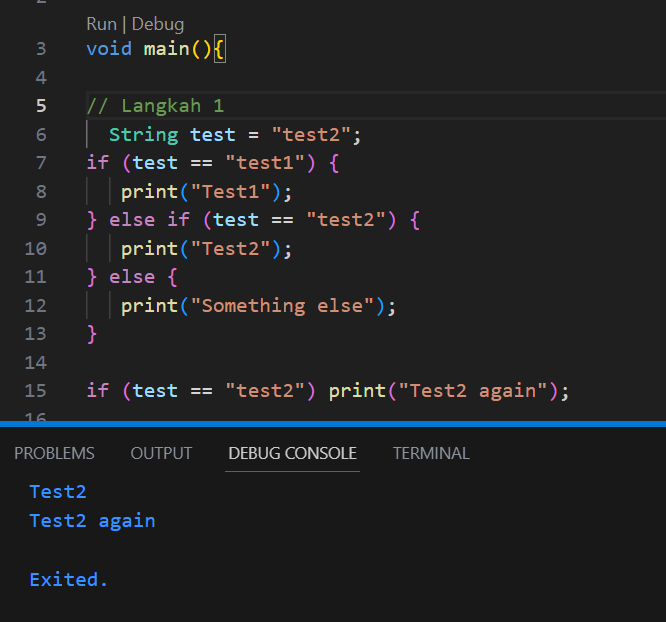
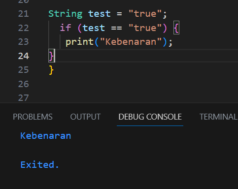
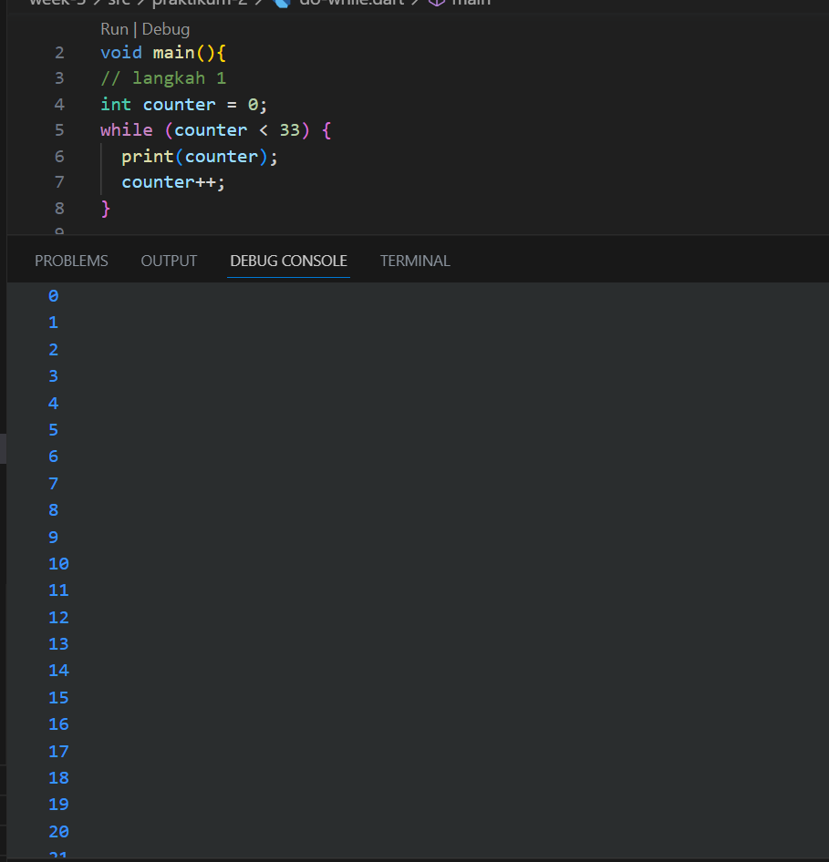
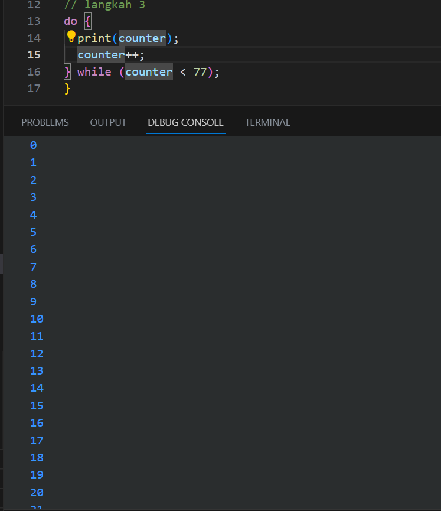
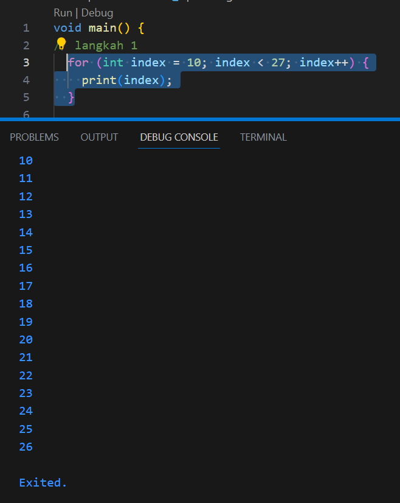
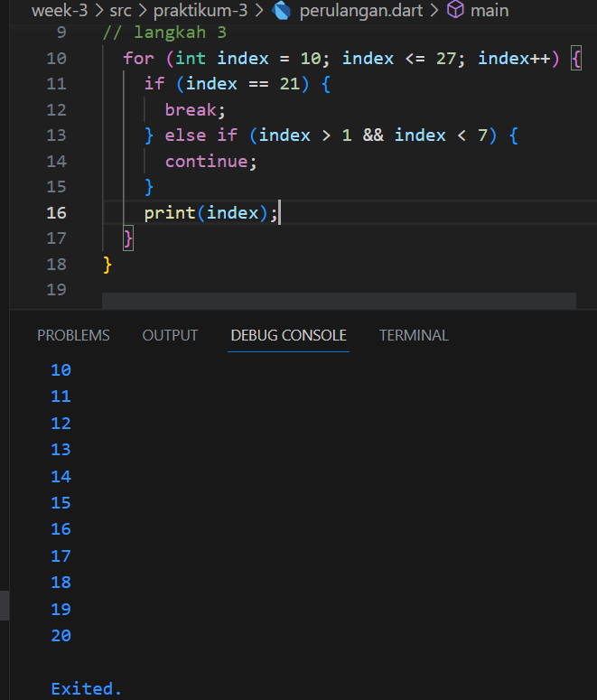
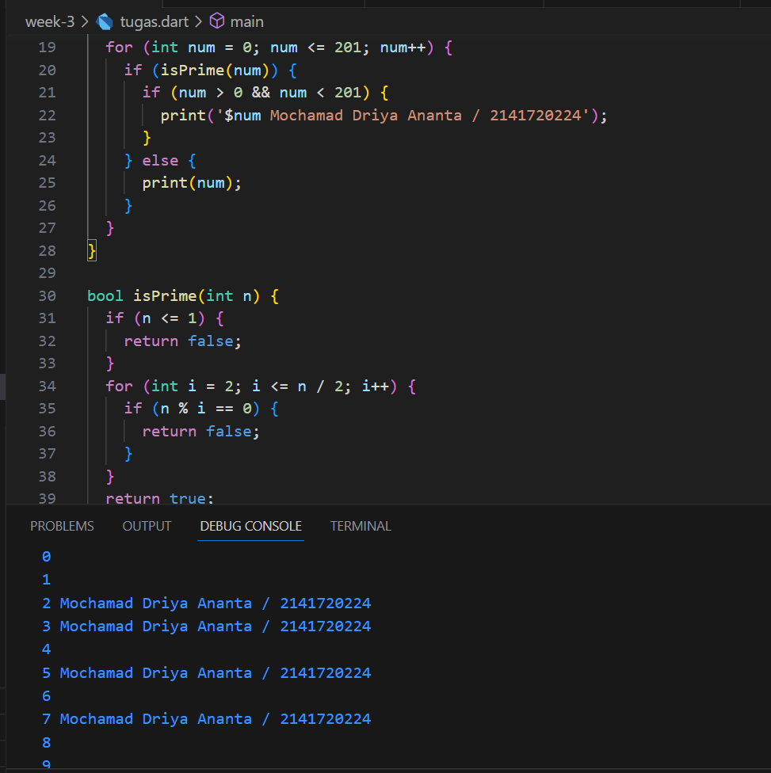

#Tugas Minggu 3, Mobile Programming

##### Nama  : Mochamad Driya Ananta
##### Kelas : TI-3H
##### Nim   : 2141720224
##### No    : 17

## Soal 1
##### Silakan selesaikan Praktikum 1 sampai 3, lalu dokumentasikan berupa screenshot hasil pekerjaan beserta penjelasannya!

##### Praktikum-1

Code diatas berfungsi untuk melakukan pengetesan menggunakan if else, dimana terdapat variabel test yang memiliki value test2 bertipe data string, lalu dilakukan pengetesan apakah benar jika test == "test2", jika benar maka akan menampilkan output Test 2, jika salah akan menampilkan something else

pada program diabwahnya juga terdapat pengtesan kembali menggunakan if, saat variabel test bernilai test2 makan akan menampilkan output Test2 again

Kode diatas melakukan pengecekan menggunakan if 
disana terdapat variabel test bernilai "true"

lalu dialakukan pengecekan apabila vatiabel test bernilai "true" maka akan menampilkan ouput Kebenaran.

##### Praktikum-2

Pada Kode diatas tedapat perulangan while, yang dimana akan menampilkan angka 0-32.

##### Praktikum-2

Pada kode program diatas akan menampilkan angka 0 - 76. tetapi disini akan dilakukan pengecekan terlebih dahulu baru dilakukan aksinya, dikarenakan menggunakan perulangan do-while

##### Praktikum-3

Pada Code program diatas adalah menggunakan for loop dimana fungsi code program diatas untuk menampilkan angka 0 - 26 dikarenakan indek awal 10 lalu dilakukan pengecekan apakah indek < 27 jika ya maka akan menampilkan output tidak lebih dari 27.

Code Program diatas akan memeriksa kondisi-kondisi berikut:
a. Jika index sama dengan 21, pernyataan break akan dijalankan. maka akan menghentikan perulangan yang ada jika kondisi terpenuhi.

b. Jika index lebih besar dari 1 dan kurang dari 7, pernyataan continue akan dijalankan. Ini akan mengabaikan sisa kode dalam iterasi saat ini dan melanjutkan ke iterasi berikutnya.

Jika kedua kondisi di atas tidak terpenuhi, pernyataan print(index) akan dijalankan. Ini akan mencetak nilai index ke konsol.

## Soal 2
##### Buatlah sebuah program yang dapa  t menampilkan bilangan prima dari angka 0 sampai 201 menggunakan Dart. Ketika bilangan prima ditemukan, maka tampilkan nama lengkap dan NIM Anda.

