#Tugas Minggu 4, Mobile Programming

##### Nama  : Mochamad Driya Ananta
##### Kelas : TI-3H
##### Nim   : 2141720224
##### No    : 17


## Praktikum 1: Eksperimen Tipe Data List

### Langkah-1
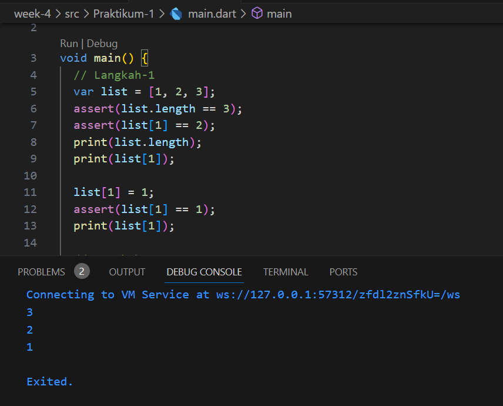
 
### Langkah-2

Silakan coba eksekusi (Run) kode pada langkah 1 tersebut. Apa yang terjadi? Jelaskan!

Jawab:
Yang terjadi adalah terdapat variabel yang bernama list yang berisi 3 nilai yaitu 1, 2, dan 3.
   1. terdapat assert yang berfungsi untuk mengecek apakah panjang list sama dengan 3. apabila tidak sama maka akan terjadi error yang disebabkan assertion-error.
   2. terdapat assert yang berfungsi untuk mengecek apakah nilai list pada index ke-1 sama dengan 2. apabila tidak sama maka akan terjadi error yang disebabkan assertion-error.
   3. terdapat print yang berfungsi untuk menampilkan panjang list.
   4. terdapat print yang berfungsi untuk menampilkan nilai list pada index ke-1.
   5. terdapat list[1] = 1 yang berfungsi untuk mengubah nilai list pada index ke-1 menjadi 1.
   6. terdapat assert yang berfungsi untuk mengecek apakah nilai list pada index ke-1 sama dengan 1. apabila tidak sama maka akan terjadi error yang disebabkan assertion-error.
   5. terdapat print yang berfungsi untuk menampilkan nilai list pada index ke-1.
   maka dapat disimpulkan kode program diatas menghasilkan output 3, 2, 1.

### Langkah-3
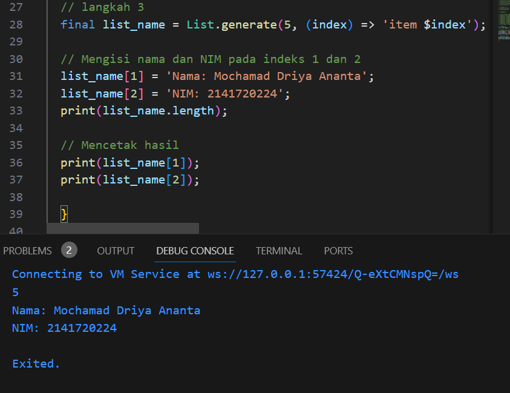
Ubah kode pada langkah 1 menjadi variabel final yang mempunyai index = 5 dengan default value = null. Isilah nama dan NIM Anda pada elemen index ke-1 dan ke-2. Lalu print dan capture hasilnya.

Apa yang terjadi ? Jika terjadi error, silakan perbaiki.

Jawab:
Yang terjadi adalah membuat list dengan array berjumlah 5 lalu mengisi nilai dari index 1 dan 2 denghan nama dan Nim 

## Praktikum 2: Eksperimen Tipe Data Set

### Langkah-1
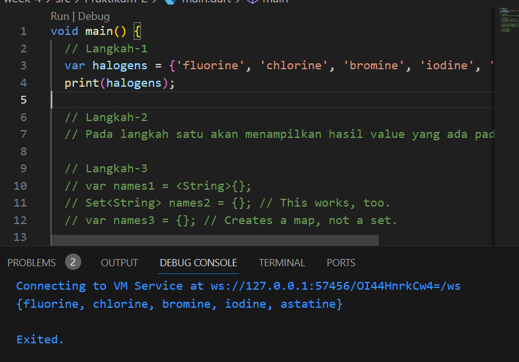

### Langkah-2
  Pada langkah satu akan menampilkan hasil value yang ada pada variabel halogens

### Langkah-3
Tambahkan kode program berikut, lalu coba eksekusi (Run) kode Anda.
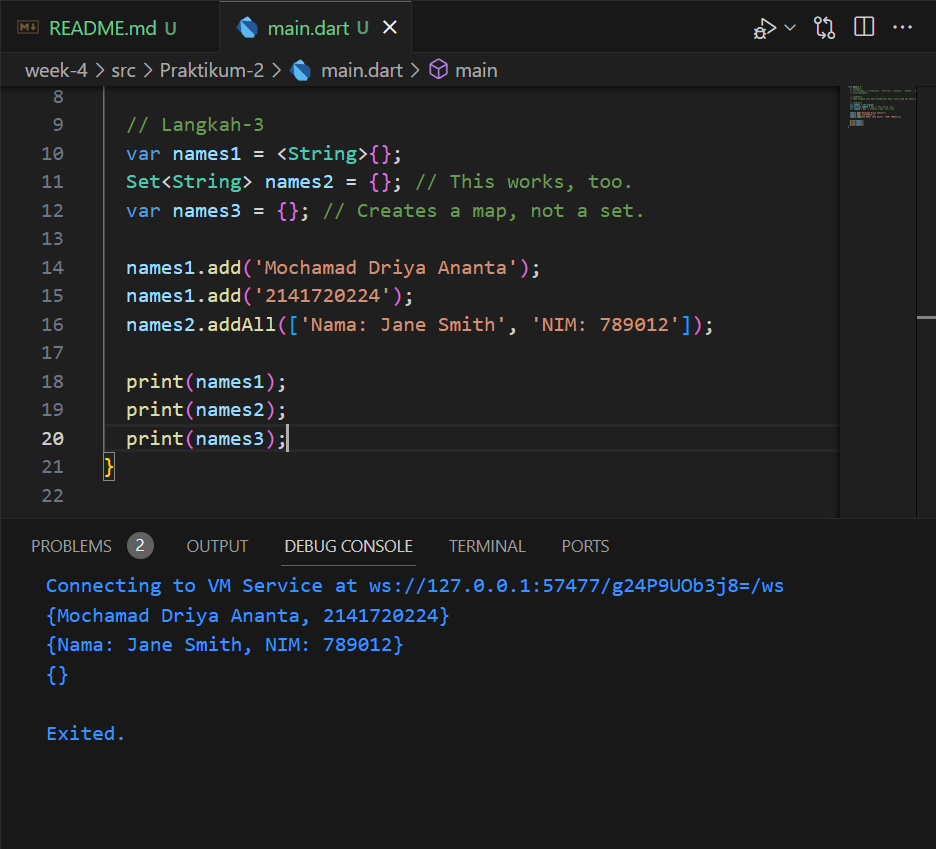
Apa yang terjadi ? Jika terjadi error, silakan perbaiki namun tetap menggunakan ketiga variabel tersebut. Tambahkan elemen nama dan NIM Anda pada kedua variabel Set tersebut dengan dua fungsi berbeda yaitu .add() dan .addAll(). Untuk variabel Map dihapus, nanti kita coba di praktikum selanjutnya.

Dokumentasikan code dan hasil di console, lalu buat laporannya.

## Praktikum 3: Eksperimen Tipe Data Maps

### Langkah-1
Ketik atau salin kode program berikut ke dalam fungsi main().
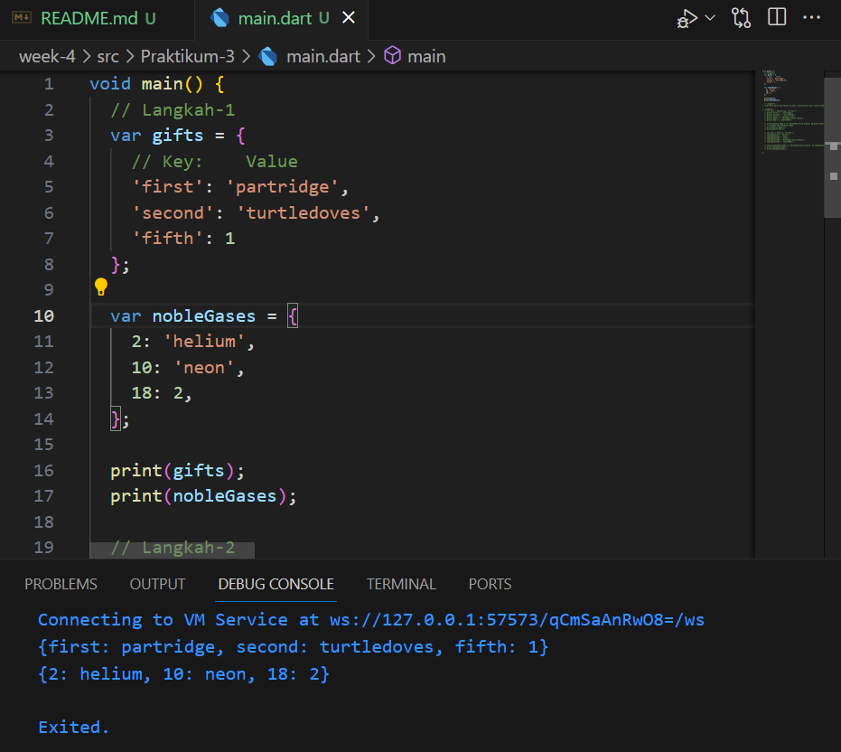

### Langkah-2
Silakan coba eksekusi (Run) kode pada langkah 1 tersebut. Apa yang terjadi? Jelaskan! Lalu perbaiki jika terjadi error.


Jawab:
Pada kode langkah 1 yang terjadi adalah pada list variabel gifts dan noblegases merupakan tipe data maps yang dimana terdapat key yang dapat menampung tipe data maupun String.

### Langkah-3
Tambahkan kode program berikut, lalu coba eksekusi (Run) kode Anda.
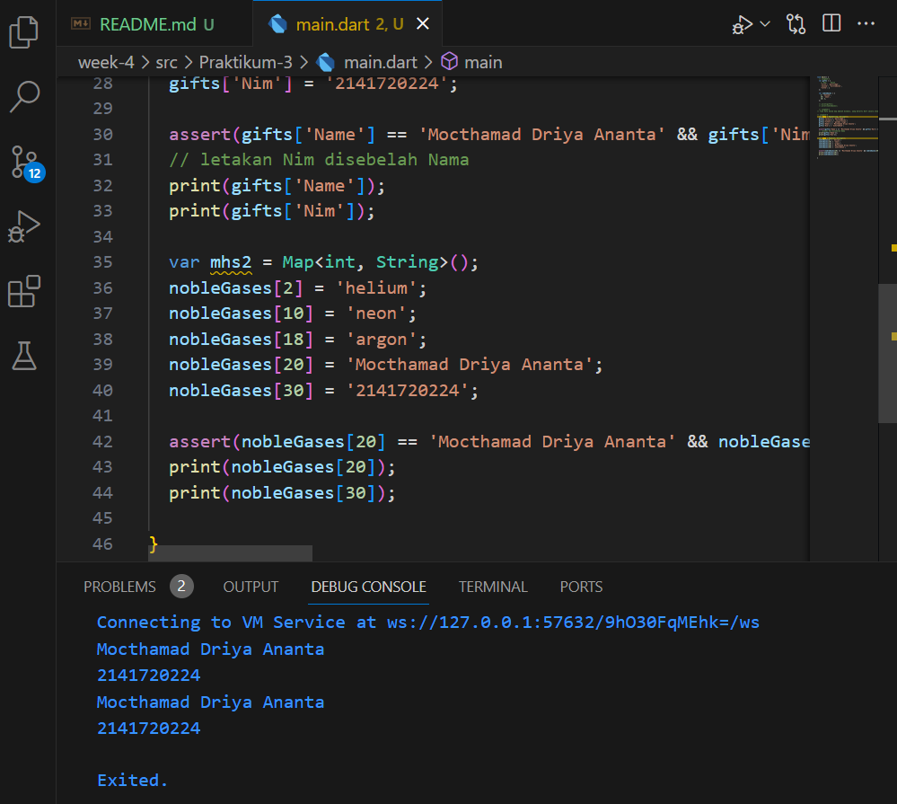
Apa yang terjadi ? Jika terjadi error, silakan perbaiki.

Tambahkan elemen nama dan NIM Anda pada tiap variabel di atas (gifts, nobleGases, mhs1, dan mhs2). Dokumentasikan hasilnya dan buat laporannya!

Jawab :
pada variabel gifts dan nobleGases ada penambahan data berupa nama Mochamad Driya Ananta dan Nim 2141720224

## Praktikum 4: Eksperimen Tipe Data List: Spread dan Control-flow Operators

### Langkah-1
Ketik atau salin kode program berikut ke dalam fungsi main().
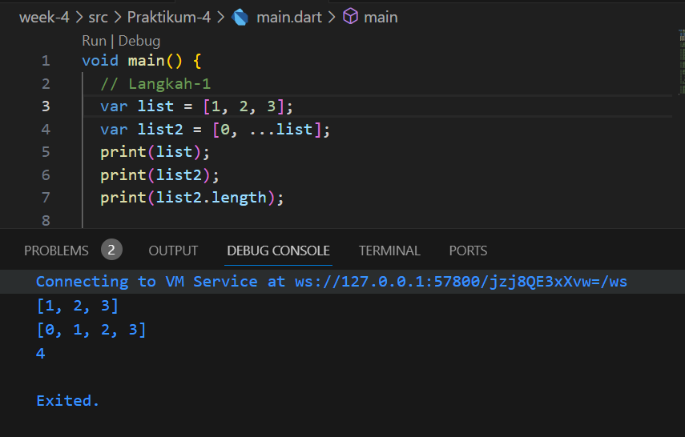

### Langkah-2


 Jawab:
 Yang terjadi adalah terdapat 2 variabel yaitu list dan list2. Variabel list berisi list angka 1, 2, 3. Variabel list2 berisi list angka 0 dan list angka 1, 2, 3. Variabel list2 memiliki panjang 4. dikarenakan pada [] terdapat variabel list yang memiliki panjang 3, maka panjang list2 adalah 3 + 1 = 4.

### Langkah-3
Tambahkan kode program berikut, lalu coba eksekusi (Run) kode Anda.
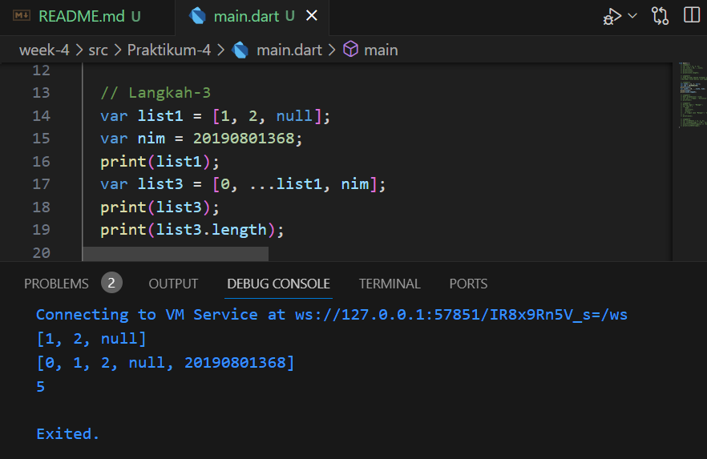
Apa yang terjadi ? Jika terjadi error, silakan perbaiki.

Tambahkan variabel list berisi NIM Anda menggunakan Spread Operators. Dokumentasikan hasilnya dan buat laporannya!

Jawab:
Terdapat penambahan data nim pada list3 sehingga panjang lengthnya sekarang 5.

### Langkah-4
Tambahkan kode program berikut, lalu coba eksekusi (Run) kode Anda.
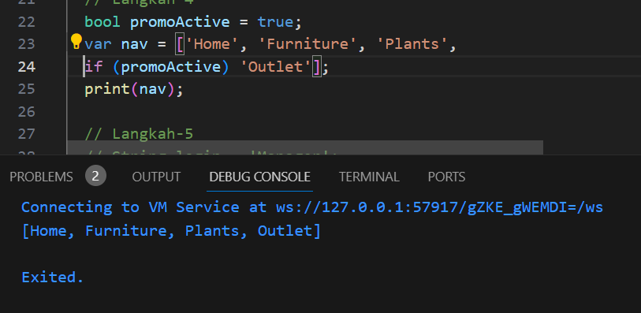

Apa yang terjadi ? Jika terjadi error, silakan perbaiki. Tunjukkan hasilnya jika variabel promoActive ketika true dan false.

Jawab:
Pada kode program diatas menghasilkan output [Home, Furniture, Plants,'disini terdapat pengecekan diamana jika varibable promoActive bernilai true maka outlet akan ditambahkan pada list']

### Langkah-5
Tambahkan kode program berikut, lalu coba eksekusi (Run) kode Anda.
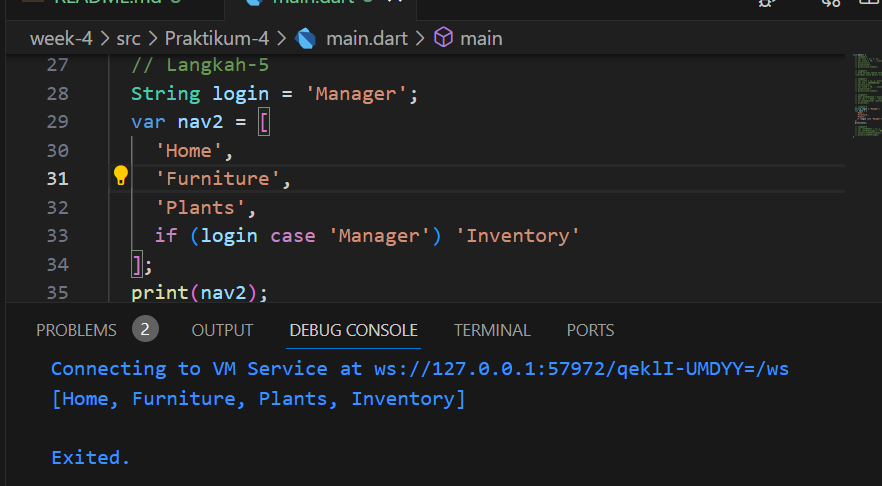
Apa yang terjadi ? Jika terjadi error, silakan perbaiki. Tunjukkan hasilnya jika variabel login mempunyai kondisi lain.

Jawab:
Pada kode program diatas menghasilkan output [Home, Furniture, Plants,'disini terdapat pengecekan diamana jika varibable login bernilai manajer maka Inventory akan ditambahkan pada list']

### Langkah-6
Tambahkan kode program berikut, lalu coba eksekusi (Run) kode Anda.

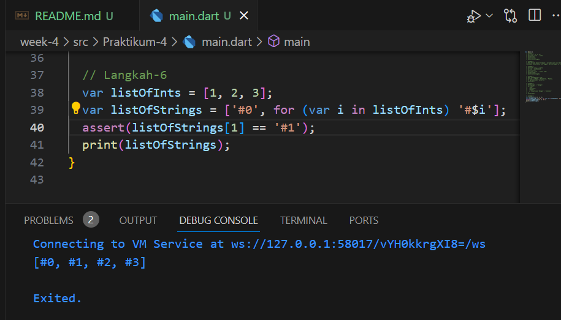

Apa yang terjadi ? Jika terjadi error, silakan perbaiki. Jelaskan manfaat Collection For dan dokumentasikan hasilnya.

Jawab:
Baris ini mendeklarasikan variabel listOfStrings dan menggunakan sintaksis collection for untuk membuat list baru berdasarkan listOfInts. Dimulai dengan elemen '#0' dan kemudian menggunakan perulangan for untuk mengiterasi setiap elemen i dalam listOfInts. Untuk setiap i, dibuat sebuah string '#$i' 

## Praktikum 5: Eksperimen Tipe Data Records

### Langkah-1
Ketik atau salin kode program berikut ke dalam fungsi main().
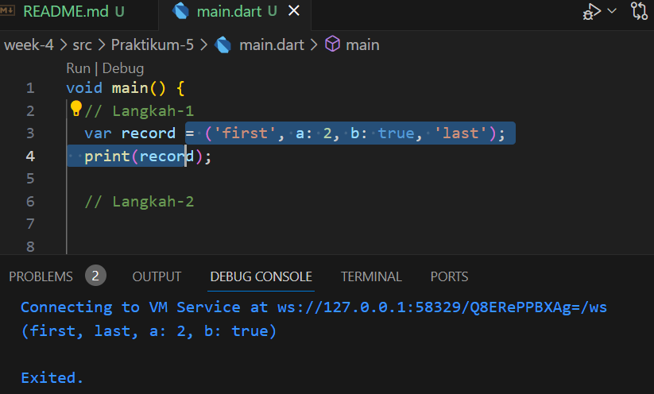

### Langkah-2


Silakan coba eksekusi (Run) kode pada langkah 1 tersebut. Apa yang terjadi? Jelaskan! Lalu perbaiki jika terjadi error.

Jawab:
Yang terjadi adalah akan menampilkan value dari variabel record

### Langkah-3
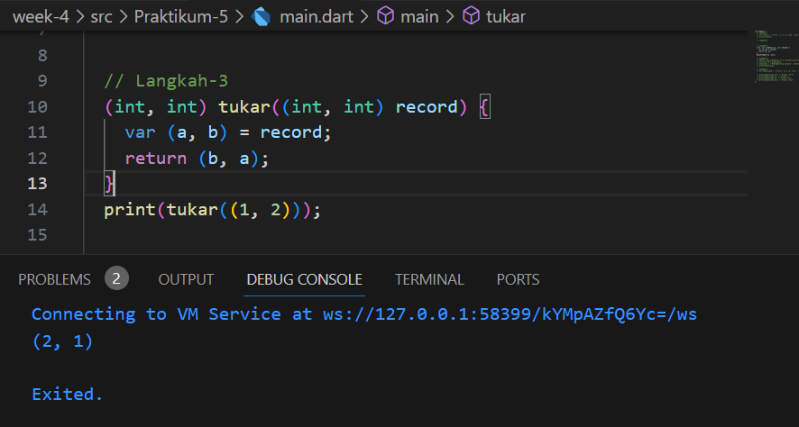

Apa yang terjadi ? Jika terjadi error, silakan perbaiki. Gunakan fungsi tukar() di dalam main() sehingga tampak jelas proses pertukaran value field di dalam Records.

Jawab:
(int, int) tukar((int, int) record) 
Baris ini mendeklarasikan fungsi tukar yang mengambil satu argumen record dengan tipe (int, int). Tipe (int, int) menunjukkan bahwa record adalah sebuah pasangan dua bilangan bulat.

var (a, b) = record;
Baris ini menggunakan sintaksis destructuring assignment dalam Dart untuk memecah elemen-elemen dalam record menjadi dua variabel a dan b. Dengan kata lain, nilai pertama dalam record akan ditugaskan ke a, dan nilai kedua akan ditugaskan ke b.

return (b, a);
Baris ini mengembalikan pasangan baru (int, int) dengan elemen-elemen yang ditukar. Elemen b akan menjadi elemen pertama dalam pasangan yang dikembalikan, sedangkan elemen a akan menjadi elemen kedua.

### Langkah-4
Tambahkan kode program berikut di dalam scope void main(), lalu coba eksekusi (Run) kode Anda.

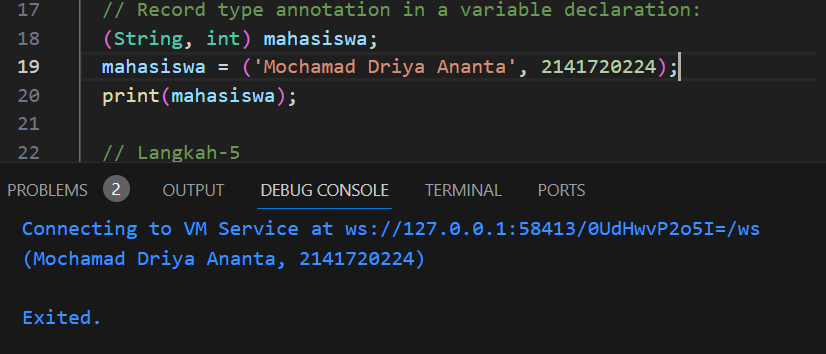

Apa yang terjadi ? Jika terjadi error, silakan perbaiki. Inisialisasi field nama dan NIM Anda pada variabel record mahasiswa di atas. Dokumentasikan hasilnya dan buat laporannya!

Jawab:
Pada kode program diatas adalah pembuatan record yang dimana didalamnya memuat tipe data String dan interger disini saya memasukan value nama dan nim.

### Langkah-5
Tambahkan kode program berikut di dalam scope void main(), lalu coba eksekusi (Run) kode Anda.

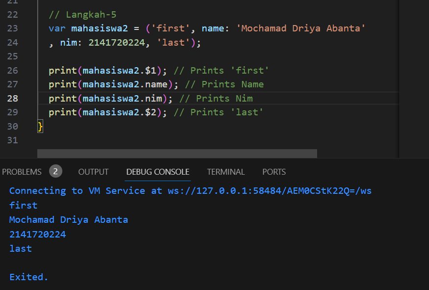

Apa yang terjadi ? Jika terjadi error, silakan perbaiki. Gantilah salah satu isi record dengan nama dan NIM Anda, lalu dokumentasikan hasilnya dan buat laporannya!

Jawab:
Pada kode program diatas akan menampilkan isi dari setiap value yang ada pada variabel mahasiswa2, tetapi disini unutk menampilkannya ada yang memakai indeks yaitu pada first dan last, sedangkan nama dan nim menggunakan key.

## Tugas Praktikum
1. Silakan selesaikan Praktikum 1 sampai 5, lalu dokumentasikan berupa screenshot hasil pekerjaan Anda beserta penjelasannya!
2. Jelaskan yang dimaksud Functions dalam bahasa Dart!
Jawab:
Dalam bahasa Dart, Functions (fungsi) adalah blok kode yang dapat digunakan untuk melakukan tugas tertentu. Fungsi dapat menerima argumen (input), melakukan operasi atau perhitungan, dan mengembalikan nilai (output) jika diperlukan. Fungsi digunakan untuk mengorganisir dan memisahkan logika program menjadi bagian-bagian yang terpisah, sehingga memudahkan pemrograman yang terstruktur dan dapat digunakan kembali (reusability).
3. Jelaskan jenis-jenis parameter di Functions beserta contoh sintaksnya!
Jawab:
1. Required Parameters (Parameter Wajib):
Required parameters adalah parameter yang harus diberikan argumen saat memanggil fungsi. Jumlah argumen dan urutan argumen harus sesuai dengan parameter yang didefinisikan. Contoh sintaks:
void greet(String name) {
  print('Hello, $name!');
}
```

2. Optional Parameters:
Dart mendukung dua jenis optional parameters, yaitu named parameters dan positional parameters.

a. Named Parameters (Parameter dengan Nama):
Named parameters memungkinkan argumen untuk diberikan dengan menggunakan nama parameter saat memanggil fungsi, sehingga urutan argumen tidak penting. Untuk mendefinisikan named parameters, menggunakan tanda kurung kurawal {} setelah parameter fungsi. Contoh sintaks:

void greet({String name, int age}) {
  print('Hello, $name! You are $age years old.');
}

b. Positional Parameters (Parameter dengan Posisi):
Positional parameters memungkinkan argumen untuk diberikan berdasarkan posisi urutan parameter saat memanggil fungsi. Untuk mendefinisikan positional parameters, menggunakan tanda kurung siku [] setelah parameter fungsi. Contoh sintaks:
void greet({String name, int age}) {
  print('Hello, $name! You are $age years old.');
}

void main() {
  greet(name: 'John', age: 25); // Menggunakan named parameters
  greet(age: 30, name: 'Jane'); // Urutan argumen tidak penting saat menggunakan named parameters
  greet('Alex', 35); // Menggunakan positional parameters
}
```

3. Default Parameters:
Default parameters memungkinkan kita untuk memberikan nilai default kepada parameter jika argumen tidak diberikan saat memanggil fungsi. Nilai default didefinisikan dengan menggunakan tanda sama dengan = setelah tipe data parameter. Contoh sintaks:

void greet(String name, {int age = 18}) {
  print('Hello, $name! You are $age years old.');
}

4. Jelaskan maksud Functions sebagai first-class objects beserta contoh sintaknya!
Jawab:
Dalam bahasa Dart, functions (fungsi) dianggap sebagai objek first-class. Artinya, fungsi dapat diperlakukan seperti objek lainnya, seperti disimpan dalam variabel, dikirim sebagai argumen ke fungsi lain, dan dikembalikan sebagai nilai dari fungsi lain. Konsep ini disebut juga dengan "functions as first-class objects" atau "higher-order functions".

Contoh sintaks:
void sayHello() {
  print('Hello!');
}

var greeting = sayHello;
greeting();  // Memanggil fungsi yang disimpan dalam variabel
```

5. Apa itu Anonymous Functions? Jelaskan dan berikan contohnya!
Jawab:
Anonymous functions (fungsi anonim) adalah fungsi yang tidak memiliki nama. Mereka juga dikenal sebagai lambda functions atau fungsi tanpa nama. Anonymous functions sangat berguna ketika kita hanya perlu mendefinisikan fungsi sederhana yang akan digunakan sekali atau sebagai argumen untuk fungsi lain.

var numbers = [1, 2, 3, 4, 5];
numbers.forEach((number) {
  print(number);
});

6. Jelaskan perbedaan Lexical scope dan Lexical closures! Berikan contohnya!
Jawab:
Lexical Scope:
Lexical scope adalah aturan yang menentukan ketersediaan variabel dalam suatu blok kode berdasarkan letak penulisan variabel dalam kode sumber. Dalam lexical scope, akses variabel ditentukan oleh struktur program yang bersifat statis. Ini berarti variabel hanya dapat diakses di dalam blok kode tempat variabel tersebut dideklarasikan atau di dalam blok kode yang bersarang di dalamnya. Contoh sederhana lexical scope adalah fungsi bersarang di dalam fungsi.

Contoh sintaks lexical scope:
void outerFunction() {
  int outerVariable = 10;

  void innerFunction() {
    int innerVariable = 20;
    print(outerVariable); // Variabel outerVariable dapat diakses dalam lexical scope innerFunction
    print(innerVariable); // Variabel innerVariable dapat diakses dalam lexical scope innerFunction
  }

  innerFunction();
}

outerFunction();

Lexical Closures:
Lexical closure terjadi ketika sebuah fungsi memiliki akses ke variabel yang berada di dalam scope yang lebih tinggi, bahkan setelah scope yang lebih tinggi tersebut selesai dieksekusi. Ini berarti fungsi closure dapat mengakses dan menggunakan variabel dari lexical scope induknya bahkan setelah induknya selesai dieksekusi. Dalam closure, variabel yang diacu tetap tersimpan di dalam memori dan dapat diakses oleh fungsi closure.

Contoh sintaks lexical closure:
Function createMultiplier(int multiplier) {
  return (int number) {
    return number * multiplier;
  };
}

void main() {
  var multiplyByTwo = createMultiplier(2);
  print(multiplyByTwo(5)); // Output: 10
}

7. Jelaskan dengan contoh cara membuat return multiple value di Functions!
Jawab:
List<int> getNumbers() {
int number1 = 1;
int number2 = 2;
int number3 = 3;
return [number1, number2, number3];
}

void main() {
var numbers = getNumbers();
print(numbers); // Output: [1, 2, 3]
print(numbers[0]); // Output: 1
print(numbers[1]); // Output: 2
print(numbers[2]); // Output: 3
}

Kode di atas adalah contoh implementasi fungsi getNumbers() yang mengembalikan sebuah List of integers. Di dalam fungsi getNumbers(), terdapat tiga variabel lokal yaitu number1, number2, dan number3, yang masing-masing memiliki nilai 1, 2, dan 3.

Fungsi getNumbers() kemudian mengembalikan List yang berisi nilai-nilai variabel tersebut, yaitu [number1, number2, number3]. Dalam kasus ini, List yang dikembalikan berupa [1, 2, 3].

Di dalam fungsi main(), kita memanggil fungsi getNumbers() dan menyimpan nilai yang dikembalikan dalam variabel numbers. Kemudian, kita mencetak nilai numbers menggunakan perintah print(). Hasilnya adalah [1, 2, 3], yang merupakan List yang berhasil diambil dari fungsi getNumbers().

Kemudian, kita mencetak elemen-elemen dalam List numbers menggunakan indeks. Dengan menggunakan indeks [0], [1], dan [2], kita dapat mengakses nilai individu dalam List tersebut. Dalam contoh ini, hasilnya adalah 1, 2, dan 3 secara berurutan.

8. Kumpulkan berupa link commit repo GitHub pada tautan yang telah disediakan di grup Telegram!


