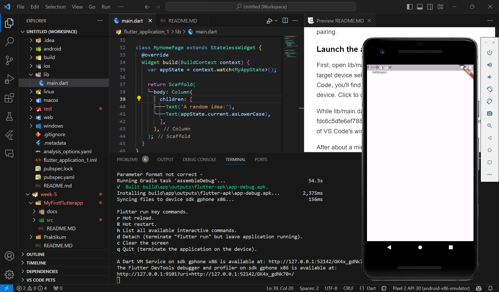
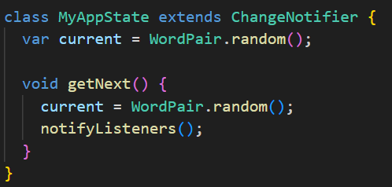
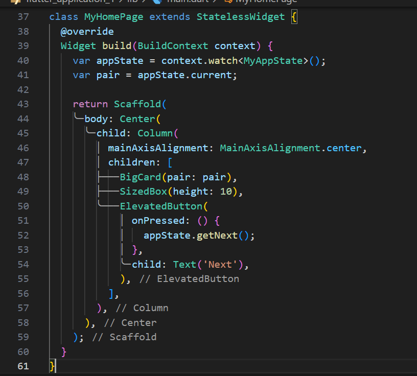
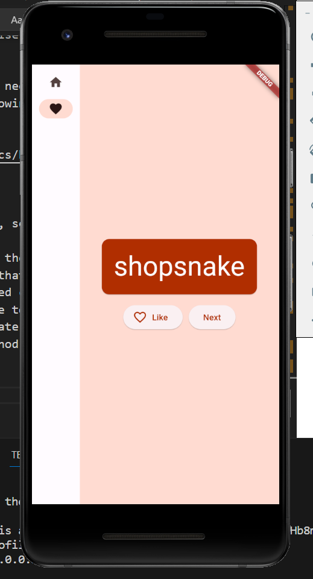
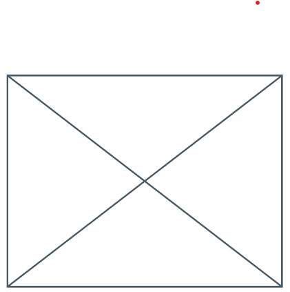
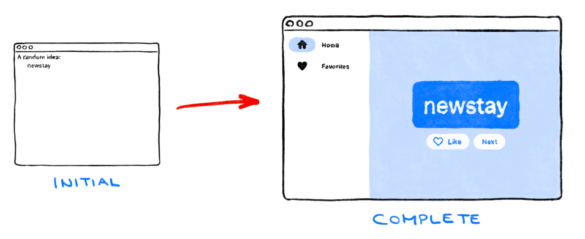

#Tugas Minggu 5, Mobile Programming

##### Nama  : Mochamad Driya Ananta
##### Kelas : TI-3H
##### Nim   : 2141720224
##### No    : 17

### Introduction

What you'll learn
-> The basics of how Flutter works
-> Creating layouts in Flutter
-> Connecting user interactions (like button presses) to app behavior
-> Keeping your Flutter code organized
-> Making your app responsive (for different screens)
-> Achieving a consistent look & feel of your app
You'll start with a basic scaffold so that you can jump straight to the interesting parts.

### 2. Set up your Flutter environment
Editor
To make this codelab as straightforward as possible, we assume you'll use Visual Studio Code (VS Code) as your development environment. It's free and works on all major platforms.

We recommend using VS Code for this codelab because the instructions default to VS Code-specific shortcuts. It's easier to say things like "click here" or "press this key" instead of something like "do the appropriate action in your editor to do X".

Choose a development target
Flutter is a multi-platform toolkit. Your app can run on any of the following operating systems:

iOS
Android
Windows
macOS
Linux
web
However, it's common practice to choose a single operating system for which you will primarily develop. This is your "development target"—the operating system that your app runs on during development.

The instructions on the Flutter website cover not only the installation of the SDK itself, but also the development target-related tools and the editor plugins. Remember that, for this codelab, you only need to install the following:

Flutter SDK
Visual Studio Code with the Flutter plugin
The software required by your chosen development target (for example: Visual Studio to target Windows, or Xcode to target macOS)
In the next section, you'll create your first Flutter project.

If you've had problems so far, you might find some of these questions and answers (from StackOverflow) helpful for troubleshooting.

### 3. Create a project

#### Create your first Flutter project
Launch Visual Studio Code and open the command palette (with F1 or Ctrl+Shift+P or Shift+Cmd+P). Start typing "flutter new". Select the Flutter: New Project command.

Next, select Application and then a folder in which to create your project. This could be your home directory, or something like C:\src\.

Finally, name your project. Something like namer_app or my_awesome_namer.

#### Copy & Paste the initial app
In the left pane of VS Code, make sure that Explorer is selected, and open the pubspec.yaml file.

Next, open another configuration file in the project, analysis_options.yaml.

This file determines how strict Flutter should be when analyzing your code. Since this is your first foray into Flutter, you're telling the analyzer to take it easy. You can always tune this later. In fact, as you get closer to publishing an actual production app, you will almost certainly want to make the analyzer stricter than this.

Finally, open the main.dart file under the lib/ directory.

### 4.Add a button
This step adds a Next button to generate a new word pairing.

#### Launch the app

First, open lib/main.dart and make sure that you have your target device selected. At the bottom right corner of VS Code, you'll find a button that shows the current target device. Click to change it.

While lib/main.dart is open, find the "play" fdc6c5dfe6ef7882.png button in the upper right-hand corner of VS Code's window, and click it.

After about a minute, your app launches in debug mode. It doesn't look like much yet:

#### First Hot Reload
At the bottom of lib/main.dart, add something to the string in the first Text object, and save the file (with Ctrl+S or Cmd+S). For example:

Notice how the app changes immediately but the random word stays the same. This is Flutter's famous stateful Hot Reload at work. Hot reload is triggered when you save changes to a source file.

#### Adding a button
Next, add a button at the bottom of the Column, right below the second Text instance.

When you save the change, the app updates again: A button appears and, when you click it, the Debug Console in VS Code shows a button pressed! message.

#### A Flutter crash course in 5 minutes

As much fun as it is to watch the Debug Console, you want the button to do something more meaningful. Before getting to that, though, take a closer look at the code in lib/main.dart, to understand how it works.

At the very top of the file, you'll find the main() function. In its current form, it only tells Flutter to run the app defined in MyApp. 

The MyApp class extends StatelessWidget. Widgets are the elements from which you build every Flutter app. As you can see, even the app itself is a widget.

The code in MyApp sets up the whole app. It creates the app-wide state (more on this later), names the app, defines the visual theme, and sets the "home" widget—the starting point of your app.

#### Your first behavior

Scroll to MyAppState and add a getNext method.

The new getNext() method reassigns current with a new random WordPair. It also calls notifyListeners()(a method of ChangeNotifier)that ensures that anyone watching MyAppState is notified.

All that remains is to call the getNext method from the button's callback.

Save and try the app now. It should generate a new random word pair every time you press the Next button.

In the next section, you'll make the user interface prettier.

#### Result

### 5. Make the app prettier
This is how the app looks at the moment.

Not great. The centerpiece of the app—the randomly generated pair of words—should be more visible. It is, after all, the main reason our users are using this app! Also, the app contents are weirdly off-center, and the whole app is boringly black & white.

#### Extract a widget

The line responsible for showing the current word pair looks like this now: Text(appState.current.asLowerCase). To change it into something more complex, it's a good idea to extract this line into a separate widget. Having separate widgets for separate logical parts of your UI is an important way of managing complexity in Flutter.

Flutter provides a refactoring helper for extracting widgets but before you use it, make sure that the line being extracted only accesses what it needs. Right now, the line accesses appState, but really only needs to know what the current word pair is.

For that reason, rewrite the MyHomePage widget as follows:

Nice. The Text widget no longer refers to the whole appState.

Now, call up the Refactor menu. In VS Code, you do this in one of two ways:

Right click the piece of code you want to refactor (Text in this case) and select Refactor... from the drop-down menu,
OR

Move your cursor to the piece code you want to refactor (Text, in this case), and press Ctrl+. (Win/Linux) or Cmd+. (Mac).

In the Refactor menu, select Extract Widget. Assign a name, such as BigCard, and click Enter.

This automatically creates a new class, BigCard, at the end of the current file. The class looks something like the following:

Notice how the app keeps working even through this refactoring.

#### Add a Card
Now it's time to make this new widget into the bold piece of UI we envisioned at the beginning of this section.

Find the BigCard class and the build() method within it. As before, call up the Refactor menu on the Text widget. However, this time you aren't going to extract the widget.

Instead, select Wrap with Padding. This creates a new parent widget around the Text widget called Padding. After saving, you'll see that the random word already has more breathing room.

Increase the padding from the default value of 8.0. For example, use something like 20 for roomier padding.

Next, go one level higher. Place your cursor on the Padding widget, pull up the Refactor menu, and select Wrap with widget....

This allows you to specify the parent widget. Type "Card" and press Enter.

This wraps the Padding widget, and therefore also the Text, with a Card widget.

#### Theme and style
To make the card stand out more, paint it with a richer color. And because it's always a good idea to keep a consistent color scheme, use the app's Theme to choose the color.

Make the following changes to BigCard's build() method.

These two new lines do a lot of work:

First, the code requests the app's current theme with Theme.of(context).
Then, the code defines the card's color to be the same as the theme's colorScheme property. The color scheme contains many colors, and primary is the most prominent, defining color of the app.
The card is now painted with the app's primary color:

You can change this color, and the color scheme of the whole app, by scrolling up to MyApp and changing the seed color for the ColorScheme there.

Notice how the color animates smoothly. This is called an implicit animation. Many Flutter widgets will smoothly interpolate between values so that the UI doesn't just "jump" between states.

The elevated button below the card also changes color. That's the power of using an app-wide Theme as opposed to hard-coding values.

#### TextTheme

The card still has a problem: the text is too small and its color is hard to read. To fix this, make the following changes to BigCard's build() method.

What's behind this change:

By using theme.textTheme, you access the app's font theme. This class includes members such as bodyMedium (for standard text of medium size), caption (for captions of images), or headlineLarge (for large headlines).
The displayMedium property is a large style meant for display text. The word display is used in the typographic sense here, such as in display typeface. The documentation for displayMedium says that "display styles are reserved for short, important text"—exactly our use case.
The theme's displayMedium property could theoretically be null. Dart, the programming language in which you're writing this app, is null-safe, so it won't let you call methods of objects that are potentially null. In this case, though, you can use the ! operator ("bang operator") to assure Dart you know what you're doing. (displayMedium is definitely not null in this case. The reason we know this is beyond the scope of this codelab, though.)
Calling copyWith() on displayMedium returns a copy of the text style with the changes you define. In this case, you're only changing the text's color.
To get the new color, you once again access the app's theme. The color scheme's onPrimary property defines a color that is a good fit for use on the app's primary color.
The app should now look something like the following:

#### Center the UI
Now that the random word pair is presented with enough visual flair, it's time to place it in the center of the app's window/screen.

First, remember that BigCard is part of a Column. By default, columns lump their children to the top, but we can easily override this. Go to MyHomePage's build() method, and make the following change:

This centers the children inside the Column along its main (vertical) axis.

The children are already centered along the column's cross axis (in other words, they are already centered horizontally). But the Column itself isn't centered inside the Scaffold. We can verify this by using the Widget Inspector.

The Widget Inspector itself is beyond the scope of this codelab, but you can see that when the Column is highlighted, it doesn't take up the whole width of the app. It only takes up as much horizontal space as its children need.

You can just center the column itself. Put your cursor onto Column, call up the Refactor menu (with Ctrl+. or Cmd+.), and select Wrap with Center.

The app should now look something like the following:

If you want, you can tweak this some more.

You can remove the Text widget above BigCard. It could be argued that the descriptive text ("A random AWESOME idea:") isn't needed anymore since the UI makes sense even without it. And it's cleaner that way.
You can also add a SizedBox(height: 10) widget between BigCard and ElevatedButton. This way, there's a bit more separation between the two widgets. The SizedBox widget just takes space and doesn't render anything by itself. It's commonly used to create visual "gaps".
With the optional changes, MyHomePage contains this code:

And the app looks like the following:

### 6. Add functionality

The app works, and occasionally even provides interesting word pairs. But whenever the user clicks Next, each word pair disappears forever. It would be better to have a way of "remembering" the best suggestions: such as a ‘Like' button.

#### Add the business logic
Scroll to MyAppState and add the following code:

Examine the changes:

You added a new property to MyAppState called favorites. This property is initialized with an empty list: [].
You also specified that the list can only ever contain word pairs: <WordPair>[], using generics. This helps make your app more robust—Dart refuses to even run your app if you try to add anything other than WordPair to it. In turn, you can use the favorites list knowing that there can never be any unwanted objects (like null) hiding in there.

You also added a new method, toggleFavorite(), which either removes the current word pair from the list of favorites (if it's already there), or adds it (if it isn't there yet). In either case, the code calls notifyListeners(); afterwards.

#### Add the button

With the "business logic" out of the way, it's time to work on the user interface again. Placing the ‘Like' button to the left of the ‘Next' button requires a Row. The Row widget is the horizontal equivalent of Column, which you saw earlier.

First, wrap the existing button in a Row. Go to MyHomePage's build() method, put your cursor on the ElevatedButton, call up the Refactor menu with Ctrl+. or Cmd+., and select Wrap with Row.

When you save, you'll notice that Row acts similarly to Column—by default, it lumps its children to the left. (Column lumped its children to the top.) To fix this, you could use the same approach as before, but with mainAxisAlignment. However, for didactic (learning) purposes, use mainAxisSize. This tells Row not to take all available horizontal space.

Make the following change:

The UI is back to where it was before.

Next, add the Like button and connect it to toggleFavorite(). For a challenge, first try to do this by yourself, without looking at the code block below.

It's okay if you don't do it exactly the same way as it's done below. In fact, don't worry about the heart icon unless you really want a major challenge.

It's also completely okay to fail—this is your first hour with Flutter, after all.

Here's one way to add the second button to MyHomePage. This time, use the ElevatedButton.icon() constructor to create a button with an icon. And at the top of the build method, choose the appropriate icon depending on whether the current word pair is already in favorites. Also, note the use of SizedBox again, to keep the two buttons a bit apart.

The app should look as follows:

Unfortunately, the user can't see the favorites. It's time to add a whole separate screen to our app. See you in the next section!

### 7. Add navigation rail

Most apps can't fit everything into a single screen. This particular app probably could, but for didactic purposes, you are going to create a separate screen for the user's favorites. To switch between the two screens, you are going to implement your first StatefulWidget.

To get to the meat of this step as soon as possible, split MyHomePage into 2 separate widgets.

Select all of MyHomePage, delete it, and replace with the following code:

When saved, you'll see that the visual side of the UI is ready—but it doesn't work. Clicking ♥︎ (the heart) in the navigation rail does nothing.

#### Stateless versus stateful widgets

Until now, MyAppState covered all your state needs. That's why all the widgets you have written so far are stateless. They don't contain any mutable state of their own. None of the widgets can change itself—they must go through MyAppState.

This is about to change.

You need some way to hold the value of the navigation rail's selectedIndex. You also want to be able to change this value from within the onDestinationSelected callback.

You could add selectedIndex as yet another property of MyAppState. And it would work. But you can imagine that the app state would quickly grow beyond reason if every widget stored its values in it.

Some state is only relevant to a single widget, so it should stay with that widget.

Enter the StatefulWidget, a type of widget that has State. First, convert MyHomePage to a stateful widget.

Place your cursor on the first line of MyHomePage (the one that starts with class MyHomePage...), and call up the Refactor menu using Ctrl+. or Cmd+.. Then, select Convert to StatefulWidget.

The IDE creates a new class for you, _MyHomePageState. This class extends State, and can therefore manage its own values. (It can change itself.) Also notice that the build method from the old, stateless widget has moved to the _MyHomePageState (instead of staying in the widget). It was moved verbatim—nothing inside the build method changed. It now merely lives somewhere else.

#### setState
The new stateful widget only needs to track one variable: selectedIndex. Make the following 3 changes to _MyHomePageState:

Examine the changes:

You introduce a new variable, selectedIndex, and initialize it to 0.
You use this new variable in the NavigationRail definition instead of the hard-coded 0 that was there until now.
When the onDestinationSelected callback is called, instead of merely printing the new value to console, you assign it to selectedIndex inside a setState() call. This call is similar to the notifyListeners() method used previously—it makes sure that the UI updates.

The navigation rail now responds to user interaction. But the expanded area on the right stays the same. That's because the code isn't using selectedIndex to determine what screen displays.

#### Use selectedIndex

Place the following code at the top of _MyHomePageState's build method, just before return Scaffold:

Examine this piece of code:

The code declares a new variable, page, of the type Widget.
Then, a switch statement assigns a screen to page, according to the current value in selectedIndex.
Since there's no FavoritesPage yet, use Placeholder; a handy widget that draws a crossed rectangle wherever you place it, marking that part of the UI as unfinished.

Applying the fail-fast principle, the switch statement also makes sure to throw an error if selectedIndex is neither 0 or 1. This helps prevent bugs down the line. If you ever add a new destination to the navigation rail and forget to update this code, the program crashes in development (as opposed to letting you guess why things don't work, or letting you publish a buggy code into production).
Now that page contains the widget you want to show on the right, you can probably guess what other change is needed.

Here's _MyHomePageState after that single remaining change:

The app now switches between our GeneratorPage and the placeholder that will soon become the Favorites page.

#### Responsiveness

Next, make the navigation rail responsive. That is to say, make it automatically show the labels (using extended: true) when there's enough room for them.

Flutter provides several widgets that help you make your apps automatically responsive. For example, Wrap is a widget similar to Row or Column that automatically wraps children to the next "line" (called "run") when there isn't enough vertical or horizontal space. There's FittedBox, a widget that automatically fits its child into available space according to your specifications.

But NavigationRail doesn't automatically show labels when there's enough space because it can't know what is enough space in every context. It's up to you, the developer, to make that call.

Say you decide to show labels only if MyHomePage is at least 600 pixels wide.

The widget to use, in this case, is LayoutBuilder. It lets you change your widget tree depending on how much available space you have.

Once again, use Flutter's Refactor menu in VS Code to make the required changes. This time, though, it's a little more complicated:

1. Inside _MyHomePageState's build method, put your cursor on Scaffold.
2. Call up the Refactor menu with Ctrl+. (Windows/Linux) or Cmd+. (Mac).
3. Select Wrap with Builder and press Enter.
4. Modify the name of the newly added Builder to LayoutBuilder.
5. Modify the callback parameter list from (context) to (context, constraints).

LayoutBuilder's builder callback is called every time the constraints change. This happens when, for example:

The user resizes the app's window
The user rotates their phone from portrait mode to landscape mode, or back
Some widget next to MyHomePage grows in size, making MyHomePage's constraints smaller
And so on
Now your code can decide whether to show the label by querying the current constraints. Make the following single-line change to _MyHomePageState's build method:

Now, your app responds to its environment, such as screen size, orientation, and platform! In other words, it's responsive!.

The only work that remains is to replace that Placeholder with an actual Favorites screen. That's covered in the next section.

### 8. Add a new page

Remember the Placeholder widget we used instead of the Favorites page?

It's time to fix this.

If you feel adventurous, try to do this step by yourself. Your goal is to show the list of favorites in a new stateless widget, FavoritesPage, and then show that widget instead of the Placeholder.

Here are a few pointers:

When you want a Column that scrolls, use the ListView widget.
Remember, access the MyAppState instance from any widget using context.watch<MyAppState>().
If you also want to try a new widget, ListTile has properties like title (generally for text), leading (for icons or avatars) and onTap (for interactions). However, you can achieve similar effects with the widgets you already know.
Dart allows using for loops inside collection literals. For example, if messages contains a list of strings, you can have code like the following:

On the other hand, if you're more familiar with functional programming, Dart also lets you write code like messages.map((m) => Text(m)).toList(). And, of course, you can always create a list of widgets and imperatively add to it inside the build method.

The advantage of adding the Favorites page yourself is that you learn more by making your own decisions. The disadvantage is that you might run into trouble that you aren't yet able to solve by yourself. Remember: failing is okay, and is one of the most important elements of learning. Nobody expects you to nail Flutter development in your first hour, and neither should you.

What follows is just one way to implement the favorites page. How it's implemented will (hopefully) inspire you to play with the code—improve the UI and make it your own.

Here's the new FavoritesPage class:

Here's what the widget does:

It gets the current state of the app.
If the list of favorites is empty, it shows a centered message: No favorites yet*.*
Otherwise, it shows a (scrollable) list.
The list starts with a summary (for example, You have 5 favorites*.*).
The code then iterates through all the favorites, and constructs a ListTile widget for each one.
All that remains now is to replace the Placeholder widget with a FavoritesPage. And voilá!

### 9. Next steps
Congratulations!

Look at you! You took a non-functional scaffold with a Column and two Text widgets, and made it into a responsive, delightful little app.

