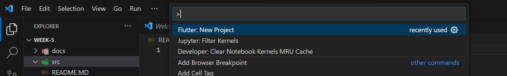
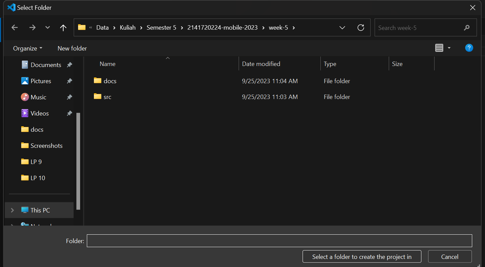
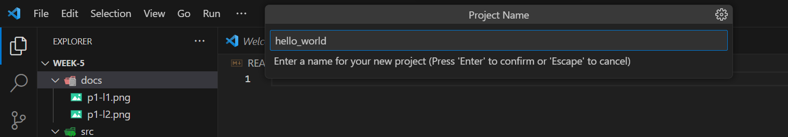
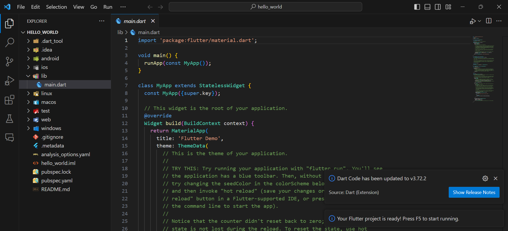

#Tugas Minggu 5, Mobile Programming

##### Nama  : Mochamad Driya Ananta
##### Kelas : TI-3H
##### Nim   : 2141720224
##### No    : 17

## Praktikum 1: Membuat Project Flutter Baru

### Langkah-1
Buka VS Code, lalu tekan tombol Ctrl + Shift + P maka akan tampil Command Palette, lalu ketik Flutter. Pilih New Application Project.

Jawab:
Pada langkah satu ini adalah langkah awal membuat project flutter
 
### Langkah-2
Kemudian buat folder sesuai style laporan praktikum yang Anda pilih. Disarankan pada folder dokumen atau desktop atau alamat folder lain yang tidak terlalu dalam atau panjang. Lalu pilih Select a folder to create the project in.

Jawab:
Lalu untuk langkah yang kedua digunakan untuk memilih folder project flutter yang akan dibuat

### Langkah-3
Buat nama project flutter hello_world seperti berikut, lalu tekan Enter. Tunggu hingga proses pembuatan project baru selesai.

Jawab:
Untuk langkah yang ketiga adalah membuat project flutter itu sendiri dengan nama project hello_world

### Langkah-4
Jika sudah selesai proses pembuatan project baru, pastikan tampilan seperti berikut. Pesan akan tampil berupa "Your Flutter Project is ready!" artinya Anda telah berhasil membuat project Flutter baru.
\

Jawab:
Untuk langkah terakhir ini adalah tampilan jika project flutter berhasil dibuat

## Praktikum 2: Membuat Repository GitHub dan Laporan Praktikum

### Langkah-1-9 DONE

### Langkah-1-10
Lakukan push juga untuk semua file lainnya dengan pilih Stage All Changes. Beri pesan commit "project hello_world". Maka akan tampil di repository GitHub Anda seperti berikut.

