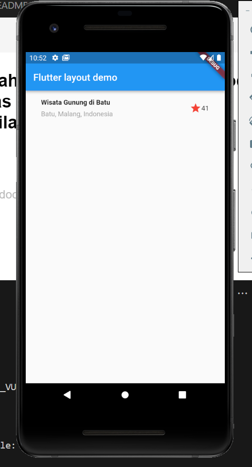
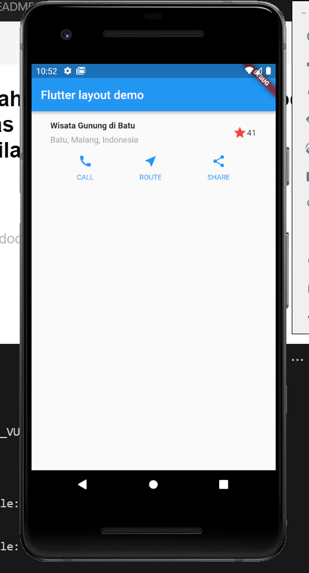
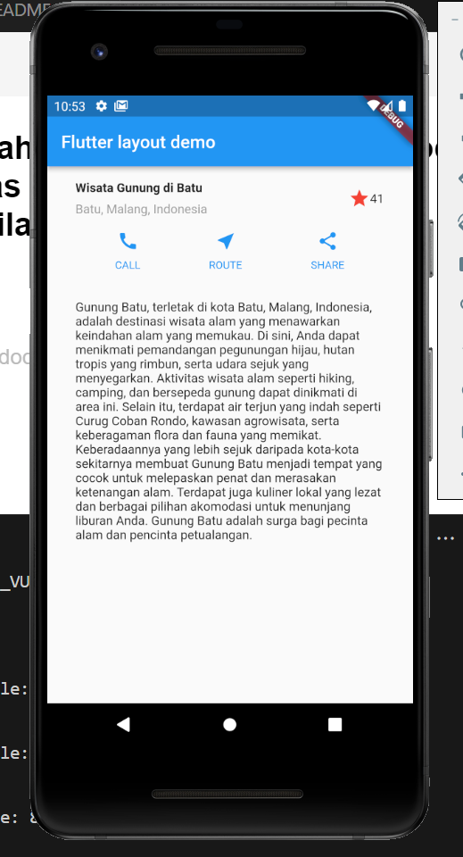
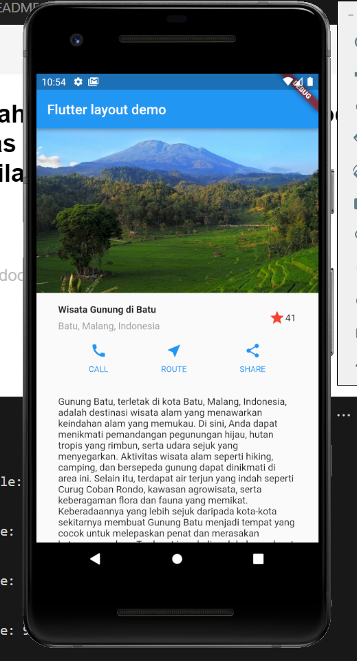

# Tugas Minggu 7, Mobile Programming Tugas-1

##### Nama  : Mochamad Driya Ananta
##### Kelas : TI-3H
##### Nim   : 2141720224
##### No    : 17

## Praktikum 1: Membangun Layout di Flutter

```dart 
Widget titleSection = Container(
      padding: const EdgeInsets.symmetric(horizontal: 32.0, vertical: 16.0),
      child: Row(
        children: [
          Expanded(
            child: Column(
              crossAxisAlignment: CrossAxisAlignment.start,
              children: [
                Container(
                  padding: const EdgeInsets.only(bottom: 8.0),
                  child: const Text(
                    'Wisata Gunung di Batu',
                    style: TextStyle(
                      fontWeight: FontWeight.bold,
                    ),
                  ),
                ),
                Text(
                  'Batu, Malang, Indonesia',
                  style: TextStyle(
                    color: Colors.grey,
                  ),
                ),
              ],
            ),
          ),
          Icon(
            Icons.star,
            color: Colors.red,
          ),
          const Text('41'),
        ],
      ),
    );
```

```dart
return MaterialApp(
      title: 'Flutter layout: Driya / 2141720224',
      home: Scaffold(
        appBar: AppBar(
          title: const Text('Flutter layout demo'),
        ),
        body: ListView(
          children: [
            titleSection,
          ],
        ),
      ),
    );
  
```
### Setelah Mengimplementasikan kode di atas maka akan menghasilkan tampilan seperti ini:



## Praktikum 2: Implementasi button row
    
```dart
Widget buttonSection = Row(
      mainAxisAlignment: MainAxisAlignment.spaceEvenly,
      children: [
        _buildButtonColumn(color, Icons.call, 'CALL'),
        _buildButtonColumn(color, Icons.near_me, 'ROUTE'),
        _buildButtonColumn(color, Icons.share, 'SHARE'),
      ],
    );


    Column _buildButtonColumn(Color color, IconData icon, String label) {
    return Column(
      mainAxisSize: MainAxisSize.min,
      mainAxisAlignment: MainAxisAlignment.center,
      children: [
        Icon(icon, color: color),
        Container(
          margin: const EdgeInsets.only(top: 8),
          child: Text(
            label,
            style: TextStyle(
              fontSize: 12,
              fontWeight: FontWeight.w400,
              color: color,
            ),
          ),
        ),
      ],
    );
```
``` dart
return MaterialApp(
      title: 'Flutter layout: Driya / 2141720224',
      home: Scaffold(
        appBar: AppBar(
          title: const Text('Flutter layout demo'),
        ),
        body: ListView(
          children: [
            titleSection,
            buttonSection,
          ],
        ),
      ),
    );
  
```

### Setelah Mengimplementasikan kode di atas maka akan menghasilkan tampilan seperti ini:



### Praktikum 3: Implementasi text section
    
```dart
     Widget textSection = Container(
      padding: const EdgeInsets.all(32),
      child: const Text(
        'Gunung Batu, terletak di kota Batu, Malang, Indonesia, adalah destinasi wisata alam yang menawarkan keindahan alam yang memukau. Di sini, Anda dapat menikmati pemandangan pegunungan hijau, hutan tropis yang rimbun, serta udara sejuk yang menyegarkan. Aktivitas wisata alam seperti hiking, camping, dan bersepeda gunung dapat dinikmati di area ini. Selain itu, terdapat air terjun yang indah seperti Curug Coban Rondo, kawasan agrowisata, serta keberagaman flora dan fauna yang memikat. Keberadaannya yang lebih sejuk daripada kota-kota sekitarnya membuat Gunung Batu menjadi tempat yang cocok untuk melepaskan penat dan merasakan ketenangan alam. Terdapat juga kuliner lokal yang lezat dan berbagai pilihan akomodasi untuk menunjang liburan Anda. Gunung Batu adalah surga bagi pecinta alam dan pencinta petualangan.',
        softWrap: true,
      ),
    );
```

``` dart
return MaterialApp(
      title: 'Flutter layout: Driya / 2141720224',
      home: Scaffold(
        appBar: AppBar(
          title: const Text('Flutter layout demo'),
        ),
        body: ListView(
          children: [
            titleSection,
            buttonSection,
            textSection,
          ],
        ),
      ),
    );

```

### Setelah Mengimplementasikan kode di atas maka akan menghasilkan tampilan seperti ini:




### Praktikum 4: Implementasi image section

```dart
ListView(
          children: [
            Image.asset(
              'assets/mount.jpg',
              width: 600,
              height: 240,
              fit: BoxFit.cover,
            ),
            titleSection,
            buttonSection,
            textSection,
            ],
        ),
```

### Setelah Mengimplementasikan kode di atas maka akan menghasilkan tampilan seperti ini:

