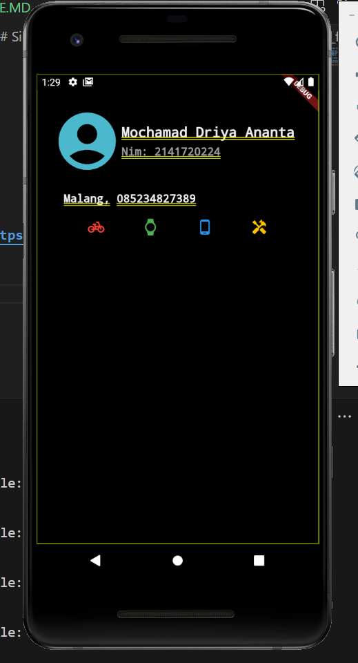

# Tugas Minggu 7, Mobile Programming Tugas-2

##### Nama  : Mochamad Driya Ananta
##### Kelas : TI-3H
##### Nim   : 2141720224
##### No    : 17

## Silakan implementasikan di project baru "basic_layout_flutter"

### Setelah Mempelajari dari Dokumentasi Flutter dari link ini :  https://docs.flutter.dev/codelabs/layout-basics akan menghasilkan inputan seperti dibawah ini :

